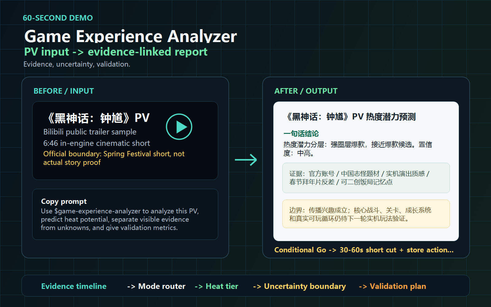
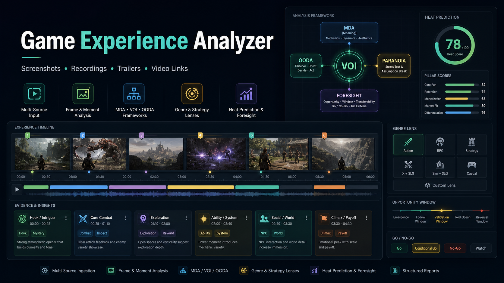
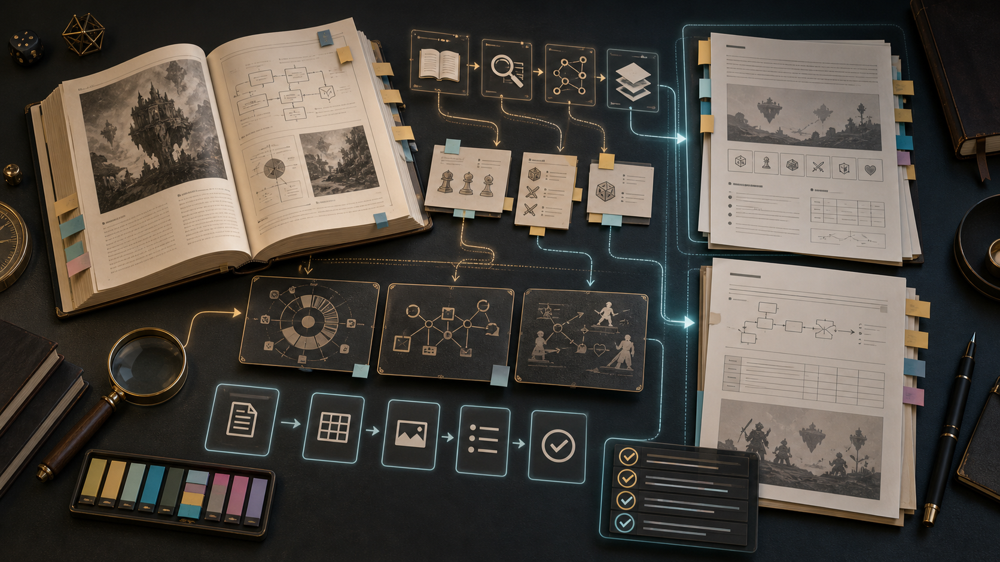

<p align="center">
  
</p>

<h1 align="center">GameDesignOS</h1>

<p align="center">
  <strong>Turn AI output into game design decisions you can verify.</strong><br>
  Local-first · Evidence-linked · Human-gated
</p>

<p align="center">
  GameDesignOS is a local-first operating layer for AI-assisted game design.
  Bring an idea, gameplay sample, research trail, or workflow problem; get reviewable evidence, experiments, proposals, decisions, and project memory—without handing commitment-changing judgment to the agent.
</p>

<p align="center">
  <a href="./README.zh-CN.md">简体中文</a> ·
  <a href="#quick-start">Quick Start</a> ·
  <a href="./docs/workflows/">Workflows</a> ·
  <a href="#featured-cases">Cases</a> ·
  <a href="./docs/product/roadmap.md">Roadmap</a>
</p>

<p align="center">
  
  
  
  
  
</p>

```text
idea / gameplay / research / workflow
                  ↓
evidence → experiment → decision → learning
                  ↑
         Human Gate + rollback
```

## Quick Start

```bash
git clone https://github.com/DY-2026/GameDesignOS.git
cd GameDesignOS
python -m pip install -e .
python -m gamedesignos ask "I want to validate a lighthouse tactics game"
```

`ask` recommends the smallest suitable skill without writing by default. For a persistent private project, create an explicit workspace:

```bash
python -m gamedesignos start "Lighthouse Tactics" --destination ../lighthouse-designos
```

## Why This Exists

AI can draft faster than a team can decide. In game design, that often creates more fragments: chat logs, screenshots, one-off prompts, competitor notes, GDD drafts, experiment ideas, and half-remembered decisions.

GameDesignOS adds the missing operating layer. It turns agent output into reviewable project assets with provenance, contracts, gates, and rollback, so a designer can move from idea to evidence to experiment to decision without rebuilding context every session.

You still make the calls. The system supplies specialist workflows, shared handoffs, local state, and the discipline to stop at Human Gates.

## What's Included

| Category | Count | What It Gives You |
| --- | ---: | --- |
| Specialist skills | 7 | Concept architecture, experience analysis, ED optimization, proposal writing, workflow evolution, book translation, and source curation |
| Contract schemas | 19 | Stable handoffs for decisions, assumptions, evidence, experiments, UL state, learning, gates, workflows, issues, player promises, AI work orders, and project assets |
| v1 workspace sections | 9 | Nine lifecycle directories: Inbox, Decisions, Assumptions, Evidence, Experiments, Design Assets, Workflows, Learning, and Exports; runtime state stays separate under `.gamedesignos/` |
| Workflow guides | 5 | Idea-to-validation, media-to-diagnosis, weekly ED experiment, evidence-to-proposal, and decision-to-information paths |
| Host adapters | 4 | Codex, Claude Code, OpenAI-compatible agents, and local harness integration notes |
| Public proof cases | 2 | Evidence-linked game-analysis and experience-density examples with explicit source boundaries |
| Runtime | 1 | Deterministic local CLI for routing, workspace creation, validation, health checks, graphs, gates, and review-safe packs |

> **Development candidate: v1.3.0.dev0.** Candidate wheels carry their own contracts/templates and `router.yaml` remains the only editable routing source. UL (Uncertainty Ladder) now has a machine-readable `ul_state` schema, UL-L0 through UL-L5, an optional workflow reference, and attribution/transfer regressions. All 7 skills still pass the Agent Skills reference validator; packaged behavior fixtures remain 9 suites / 53 evals. The latest formal release remains v1.2.0.

## Project-Ready Runtime

v1.2.0 keeps the local `gamedesignos` runtime Project-Ready and adds Intent Work Orders plus `workflow-run.governance`: AI work starts from the reality to change, every workflow can preserve intent / VOI / RJR / Human Gate / rollback / candidate-learning refs, and domain skills still own their specialist outputs. The CLI is deterministic and local-first: it creates v1 workspaces, manages Decisions, Assumptions, Evidence, Experiments, Gates, Workflows, and Learning, exports decision graphs, scans project health, and builds review-safe packs without calling a model.

| Layer | Purpose | Entry |
| --- | --- | --- |
| **Skill Kernel** | Seven bounded specialist workflows | [`Current Skills`](#current-skills) |
| **Contract Layer** | Stable handoffs, schemas, and routing boundaries | [`contracts/`](./contracts/) |
| **Project Workspace** | Durable decision, assumption, evidence, experiment, workflow, and learning assets | [`runtime/workspace-template-v1/`](./runtime/workspace-template-v1/) |
| **Runtime Interface** | Executable local commands plus host-agent integration boundaries | [`runtime/`](./runtime/) / [`gamedesignos/`](./gamedesignos/) |

Start a private workspace:

```bash
python -m pip install -e .
gamedesignos "I want to make a lighthouse tactics game"
```

The natural-language entry recommends the right skill without writing by default. Supply a destination or workspace to prepare the first Decision, Assumption, three-minute validation Experiment, VOI Gate, and workflow, or use the explicit `start` command. Existing skill folders remain independently installable; the runtime remains compatible with v0.8/v0.9 workspaces.

Read the [v1.0 baseline plan](./docs/product/v1.0-development-plan.md), [CLI guide](./runtime/cli/README.md), [command reference](./runtime/cli/commands.md), [v1.2 release note](./releases/v1.2.0.md), and [product roadmap](./docs/product/roadmap.md).

Decision-first research prompt:

```text
Use $paranoia-ai-system-evolver to audit this research or AI workflow with a Decision Object, current default action, decision boundary, EVPI/EVSI, signal-to-action map, the smallest high-VOI probe, and a stop rule.
```

RJR-AI upgrade prompt:

```text
Use $paranoia-ai-system-evolver to turn this AI workflow into an RJR-AI system: list what AI can search or draft, what workflow must constrain, what evals must test, what permissions block overreach, what knowledge should persist, and which residual judgments must stay with a human.
```

Intent Work Order prompt:

```text
Use $paranoia-ai-system-evolver to upgrade this AI work order from an instruction sheet into an Intent Work Order: define the reality to change, project goal, desired outside-world state, verifier, first-glance acceptance, non-sacrifice boundaries, AI freedom, AI no-touch boundary, direction-change principles, delivery failure signals, and retrospective candidate learning.
```

## What This Is

`GameDesignOS` is a local-first operating system for AI-assisted game design. It turns AI-agent sessions into durable design assets: decisions, assumptions, evidence, experiments, proposals, workflows, and learning records.

Its public base consists of a **Skill Kernel**, **Contract Layer**, **Project Workspace**, and executable **Runtime Interface** for concept validation, gameplay diagnosis, proposal writing, and workflow evolution.

The skills provide bounded expert behavior. Contracts make outputs interoperable. The workspace preserves project context. The runtime layer gives a host agent or local CLI deterministic commands for reading, routing, writing, validating, packing, and stopping at Human Gates.

It is not a scattered skill list or a prompt dump. It is closer to a compact operating system for serious game design work, with contracts that let skills hand work to each other instead of producing isolated prose:

```text
media evidence -> evidence index -> issue cards -> ED handoff -> weekly experiments
one-line idea -> player-promise contract -> validation plan -> later media diagnosis
concept/evidence/production notes -> decision-ready proposal -> pitch or milestone gate
workflow change -> WOOP Task Card -> VOI/OODA probe -> eval -> Human Gate -> rollback
books and sources -> structured knowledge assets -> better references for future work
```

## What Makes It Different

- **Evidence-first:** judgments point back to sources, screenshots, timestamps, sample evidence, or validation metrics.
- **Contract-driven:** concept briefs, evidence indexes, issue cards, ED handoffs, and validation plans can move across skills.
- **Workspace-native:** concepts, evidence, analysis, experiments, proposals, decisions, and retrospectives remain connected inside one project.
- **Human-gated:** agents can propose and structure work, but commitment-changing decisions are recorded by people.
- **Residual-judgment authority:** high-coupling, low-reversibility, under-evidenced choices stay human-owned while AI, workflow, evals, permissions, and memory align around the chosen direction.
- **Decision-first information:** before broad research, the system names the decision, current default action, decision boundary, signal-to-action map, information costs, and stop rule.
- **Concept-to-validation:** a promising idea becomes a seed, a player promise, a core loop, a scope gate, and a prototype test.
- **Workflow-governed:** useful behavior is written into `SKILL.md`, `references/`, `templates/`, evals, Human Gates, and rollback paths.
- **Agent portable:** Codex, Claude Code, OpenCode, or any Markdown-skill-capable agent can adapt the packages.
- **Public/private safe:** public examples stay synthetic, public, cleared, or marked `needs_review`; real projects stay in your own environment.

## Try It in 5 Prompts

```text
Use $game-experience-analyzer to diagnose this PV or gameplay recording into sample boundary, timestamped evidence, Hook/Loop/Link/Surprise diagnosis, issue cards, and validation recommendations.
```

```text
Use $game-concept-architect to turn this one-line game idea into concept seed extraction, design nucleus options, player promise contract, core loop, scope gate, and prototype validation plan.
```

```text
Use $game-design-proposal-writer to turn this concept brief, validation plan, evidence notes, and production constraints into a decision-ready commercial proposal, indie dossier, publisher pitch, or vertical-slice document.
```

```text
Use $paranoia-ai-system-evolver to upgrade this workflow or AI work order into an Intent Work Order with a WOOP Task Card, VOI, OODA, eval checks, Human Gate, rollback, and retrospective candidate learning.
```

```text
Use $game-experience-density-optimizer to turn this first-session retention, pacing, or experience density problem into an ED diagnosis, CLP/SF/EB/AR/MD-min levers, a weekly A/B plan, instrumentation, dashboard fields, decision rules, and rollback gates.
```

For the full onboarding path, see [Try It in 10 Minutes](./docs/try-it-in-10-minutes.md).

## 60-Second Demo

Start with one screenshot, gameplay recording, trailer/PV, or video link. Ask the skill for an evidence-linked report:

<p align="center">
  
</p>

```text
Use $game-experience-analyzer to analyze this gameplay recording into timestamped evidence, feature exposure/unlock/first-use ledger, Hook/Loop/Link/Surprise diagnosis, and actionable fixes.
```

For concrete proof paths, continue to the cases below. The demo above shows the fast interaction pattern; the cases show reviewable outputs and their evidence boundaries.

## Featured Cases

If you are browsing on GitHub, start with these two cases. The first shows a single gameplay recording turning into a Game Experience Analyzer report; the second shows how public video evidence flows into an Experience Density experiment package.

| Case | Skill Route | What To Look For | Link |
| --- | --- | --- | --- |
| `《生存33天》41 min gameplay recording` | `$game-experience-analyzer` | A recording sample becomes timestamped evidence, visual evidence cards, feature exposure/unlock/first-use ledger, early-loop diagnosis, UI/guide risks, and validation-ready fixes. Source status: `needs_review`. | [Open report](./game-experience-analyzer/examples/survival-33-days-gameplay-experience-report.md) |
| `《冒险家艾略特的千年奇谭》Demo` | `$game-experience-analyzer -> $game-experience-density-optimizer` | Public video frames become an ED evidence gate, metric horizon, screenshot evidence cards, variant matrix, instrumentation, and rollback rules. | [Open case](./docs/showcases/elliot-experience-density-report/README.md) |

## Easy Start

For ongoing work, start a project workspace so context persists. For a one-off task, you can still call a skill directly.

### 1. Start a project workspace

```bash
python -m pip install -e .
gamedesignos "I want to make a lighthouse tactics game"
```

Keep private material outside this public repository. The natural-language entry remains route-only unless you supply a destination or workspace; use `start` for an explicit long-lived project setup.

### 2. Pick the right skill

| What you have | Use this skill | What you get |
| --- | --- | --- |
| Screenshot, recording, PV/trailer, or video link | `$game-experience-analyzer` | A game experience report with timestamps, evidence, issue priorities, game dissection, mechanic transfer boundaries, and validation plans |
| One-line game idea | `$game-concept-architect` | Concept seed, player verbs, action-goal alignment, player promise, core loop, scope gate, and validation plan |
| Concept, evidence, validation notes, or production constraints | `$game-design-proposal-writer` | Decision-ready commercial proposal, indie design dossier, publisher pitch, one-page memo, or vertical-slice document |
| Prompt, workflow, schema, agent rule, or project process | `$paranoia-ai-system-evolver` | Intent Work Order, workflow governance review, and WOOP/VOI/OODA/eval/Human Gate/rollback-backed evolution proposal |
| English game design chapter or essay | `$game-design-book-translator` | Professional Chinese design translation with reviewable terminology |
| Articles, videos, creators, or websites | `$game-design-source-curator` | Maintainable game design knowledge-base entries |
| Retention, pacing, feedback, embodiment, atmosphere, or cognitive-load problem | `$game-experience-density-optimizer` | ED diagnosis, weekly A/B variants, instrumentation, dashboard fields, and rollback gates |

### 3. Copy a minimal prompt

Call a skill directly in an agent environment that supports skill loading:

```text
Use $game-experience-analyzer to analyze this gameplay recording into timestamped evidence, design lenses, heat potential, foresight windows, Go/No-Go, and validation recommendations.
```

```text
Use $game-experience-analyzer to dissect this game into player verbs, action-goal alignment, uncertainty sources, system dynamics, content flow, audience desire, transfer boundaries, and validation recommendations.
```

```text
Use $paranoia-ai-system-evolver to upgrade this prompt/workflow/schema/work order into an Intent Work Order with WOOP, VOI, OODA, evals, Human Gate, rollback, and retrospective candidate learning.
```

```text
Use $game-design-book-translator to translate and polish this game design chapter into professional Chinese, including terminology and figure captions.
```

```text
Use $game-design-source-curator to review these game design sources and turn accepted items into a maintainable local knowledge base.
```

```text
Use $game-concept-architect to turn this one-line game idea into a concept seed, player verbs, action-goal alignment, player promise, core loop, scope gate, production feasibility check, and prototype validation plan.
```

```text
Use $game-design-proposal-writer to assemble this research, concept brief, evidence index, validation plan, and team constraints into a publisher pitch outline with proof of play, scope gate, budget assumptions, risks, and decision request.
```

```text
Use $game-experience-density-optimizer to turn this first-session experience density problem into CLP/SF/EB/AR/MD-min diagnosis, rollbackable weekly variants, telemetry events, dashboard fields, and pre-registered decision rules.
```

### 4. Install a skill in your own agent environment

If your tool supports local skills, copy the target folder into that tool's skill directory:

```text
game-experience-analyzer/
paranoia-ai-system-evolver/
game-design-book-translator/
game-design-source-curator/
game-concept-architect/
game-experience-density-optimizer/
game-design-proposal-writer/
```

After installation, check that the `SKILL.md` frontmatter `name` matches the folder name, and that relative links inside `references/`, `templates/`, and `examples/` still resolve.

## Showcase

Seven bounded entry points cover the main GameDesignOS workflow: concept architecture, evidence and diagnosis, proposal assembly, experience-density iteration, workflow governance, design-text translation, and source curation.

<table>
  <tr>
    <td width="25%">
      <a href="./game-concept-architect/"></a>
    </td>
    <td width="25%">
      <a href="./game-experience-analyzer/"></a>
    </td>
    <td width="25%">
      <a href="./game-design-proposal-writer/"></a>
    </td>
    <td width="25%">
      <a href="./game-experience-density-optimizer/"></a>
    </td>
  </tr>
  <tr>
    <td><a href="./game-concept-architect/"><b>Architect game concepts</b></a><br>Turn a one-line idea into a seed, player verbs, action-goal alignment, player promise, core loop, scope gate, and validation plan.</td>
    <td><a href="./game-experience-analyzer/"><b>Analyze game experience</b></a><br>Convert screenshots, recordings, trailers, and video links into evidence-first diagnosis, game dissection, and mechanic-transfer judgment.</td>
    <td><a href="./game-design-proposal-writer/"><b>Assemble proposals</b></a><br>Turn research, concept contracts, evidence notes, validation plans, and production constraints into review-ready proposals and pitches.</td>
    <td><a href="./game-experience-density-optimizer/"><b>Optimize experience density</b></a><br>Turn retention, pacing, feedback, embodiment, atmosphere, and cognitive-load issues into weekly ED experiments.</td>
  </tr>
</table>

<table>
  <tr>
    <td width="33%">
      <a href="./paranoia-ai-system-evolver/"></a>
    </td>
    <td width="33%">
      <a href="./game-design-book-translator/"></a>
    </td>
    <td width="33%">
      <a href="./game-design-source-curator/"></a>
    </td>
  </tr>
  <tr>
    <td><a href="./paranoia-ai-system-evolver/"><b>Evolve workflows</b></a><br>Upgrade prompts, schemas, evals, memory, and tool routing through WOOP, VOI, OODA, gates, and rollback.</td>
    <td><a href="./game-design-book-translator/"><b>Translate design knowledge</b></a><br>Transform serious game design books and chapters into professional Chinese design writing.</td>
    <td><a href="./game-design-source-curator/"><b>Curate sources</b></a><br>Turn scattered articles, videos, creators, columns, and websites into a durable game design knowledge base.</td>
  </tr>
</table>

For the compact proof-path list, see the [showcase index](./docs/showcases/README.md).

## System Architecture

`GameDesignOS` is organized as four product layers plus a cross-cutting governance plane. The current v1.3 candidate adds optional UL between VOI selection and OODA execution without migrating the v1 workspace schema:

- **Skill Kernel**
  - [`game-concept-architect/`](./game-concept-architect/): one-line idea -> verifiable design blueprint.
  - [`game-experience-analyzer/`](./game-experience-analyzer/): media/sample -> evidence-linked diagnosis.
  - [`game-experience-density-optimizer/`](./game-experience-density-optimizer/): bounded experience problem -> weekly experiment.
  - [`game-design-proposal-writer/`](./game-design-proposal-writer/): concept/evidence/constraints -> decision-ready proposal.
  - [`paranoia-ai-system-evolver/`](./paranoia-ai-system-evolver/): workflow/schema/eval change -> controlled evolution.
  - [`game-design-book-translator/`](./game-design-book-translator/): design texts -> professional Chinese design writing.
  - [`game-design-source-curator/`](./game-design-source-curator/): scattered sources -> durable knowledge base.
- **Contract Layer**
  - [`contracts/`](./contracts/): routing, skill handoffs, `ul-state.schema.json`, project manifests, asset indexes, and decision logs.
- **Project Workspace**
  - [`runtime/workspace-template-v1/`](./runtime/workspace-template-v1/): project identity, lifecycle directories, asset registry, learning records, exports, and Human Gates.
- **Runtime Interface**
  - [`gamedesignos/`](./gamedesignos/), [`runtime/`](./runtime/), and [`adapters/`](./adapters/): local CLI commands, workspace lifecycle, host integration, and command contracts.
- **Governance**
  - evidence boundaries, public/private separation, VOI, optional UL, RJR-AI, evals, Human Gates, and rollback apply across every layer.

Private overlays, real project data, client examples, credentials, and local studio rules should live outside this public repository. Users may still run any skill directly without adopting a workspace.

## Current Skills

| Skill | One-line Use | Best For | Package |
| --- | --- | --- | --- |
| **Game Experience Analyzer** | Turns screenshots, gameplay recordings, trailers/PVs, and video links into evidence-first Chinese game design reports. | Early experience, mechanics, game dissection, mechanic transfer, holistic product analysis, MDA, systems-narrative fusion, single-player flow, genre strategy, heat prediction, foresight windows, monetization, UX. | [`game-experience-analyzer/`](./game-experience-analyzer/) |
| **Paranoia AI System Evolver** | Turns AI work orders, prompts, workflows, memory, schemas, tool-routing, eval, and RJR-AI authority changes into controlled system evolution. | Intent Work Orders, WOOP, VOI, UL, OODA, residual judgment, failure attribution, transfer checks, Human Gates, and rollback. | [`paranoia-ai-system-evolver/`](./paranoia-ai-system-evolver/) |
| **Game Design Book Translator** | Produces professional Chinese game design translations that read like serious design writing. | Terminology, chapters, figures, captions, tables, QA, source-boundary checks. | [`game-design-book-translator/`](./game-design-book-translator/) |
| **Game Design Source Curator** | Converts scattered game design sources into a durable local knowledge base. | Source screening, scoring, HTML archives, registries, update history, design experiment cards. | [`game-design-source-curator/`](./game-design-source-curator/) |
| **Game Concept Architect** | Turns one-line game ideas into verifiable concept briefs with seed extraction, player verbs, action-goal alignment, player promises, core loops, scope gates, and prototype validation plans. | Indie game ideation, pitch shaping, external feasibility, platform/business fit, MVP/vertical slice planning, production constraints. | [`game-concept-architect/`](./game-concept-architect/) |
| **Game Experience Density Optimizer** | Turns experience density, retention, pacing, feedback, embodiment, atmosphere, and cognitive-load problems into weekly ED experiments. | First-session tuning, prototype feel, live-ops micro tests, A/B variants, telemetry dictionaries, dashboard specs, rollback gates. | [`game-experience-density-optimizer/`](./game-experience-density-optimizer/) |
| **Game Design Proposal Writer** | Turns research, concept contracts, evidence notes, validation plans, production constraints, and business goals into decision-ready game proposals. | Commercial product proposals, indie design dossiers, publisher/investor pitches, one-page decision memos, demo and vertical-slice planning. | [`game-design-proposal-writer/`](./game-design-proposal-writer/) |

## Use Cases

- **Competitor experience review:** turn a gameplay recording into a timeline, feature ledger, loop diagnosis, issue priority, and concrete fixes.
- **Game dissection and mechanic transfer:** break a sample into player verbs, goal layers, uncertainty, system dynamics, content flow, audience desire, playable theme, and transfer boundaries.
- **Trailer heat prediction:** evaluate first seconds, one-line value proposition, proof of play, channel fit, conversion path, and validation plan.
- **Foresight opportunity:** judge whether a genre, theme, or mechanic still has a window; casual/light defaults to 1-3 months, micro/midcore-heavy defaults to 3-6 months.
- **Source curation:** turn articles, videos, creators, columns, and websites into searchable, citable, experiment-ready design knowledge.
- **Professional translation:** translate game design books or essays while preserving terminology, argument structure, and figure context.
- **Workflow evolution:** promote useful agent behavior into candidate rules with evals, Human Gate, and rollback.
- **Cross-skill handoff:** move from concept promise to media diagnosis to ED experiment through shared contracts instead of rewriting context by hand.
- **Concept feasibility:** turn a one-line idea into concept seed extraction, player verbs, action-goal alignment, player promises, core loop design, scope gate, production feasibility, and prototype validation.
- **Proposal assembly:** turn validated concepts, source notes, evidence, risks, and production constraints into reviewable commercial proposals, indie dossiers, pitch outlines, or vertical-slice documents.
- **Experience density experiments:** turn first-session, pacing, feedback, embodiment, atmosphere, or cognitive-load issues into weekly ED experiments with metrics and rollback gates.

## Repository Layout

Read the repository as a GameDesignOS public base rather than a normal asset folder.

| Layer | Paths | Purpose |
| --- | --- | --- |
| Skill Kernel | `game-experience-analyzer/`, `game-concept-architect/`, `game-design-proposal-writer/`, `paranoia-ai-system-evolver/`, `game-design-book-translator/`, `game-design-source-curator/`, `game-experience-density-optimizer/` | Independently installable specialist packages. |
| Contract Layer | `contracts/` | Skill handoffs, routing, project manifest, asset index, and decision-log schemas. |
| Runtime / CLI | `gamedesignos/`, `runtime/` | Executable local commands, workspace template, lifecycle rules, and CLI command contracts. |
| Product and workflows | `docs/product/`, `docs/workflows/` | Product boundary, architecture, roadmap, and end-to-end project routes. |
| Public onboarding and proof | `README*`, `docs/`, `releases/` | Onboarding, release history, public-safe examples, and proof paths. |
| Adapters and validation | `adapters/`, `.github/`, `scripts/` | Host integration, CI, repository checks, and behavior evals. |
| Governance and media | `CONTRIBUTING.md`, `LICENSE`, `assets/` | Contribution boundary, licensing, and public visual assets. |

Most skills follow this structure:

```text
SKILL.md      -> agent entrypoint, triggers, workflow, boundaries
references/  -> methods, scoring rules, routers, gates, validation playbooks
templates/   -> reusable forms and output structures
examples/    -> reviewable example outputs
agents/      -> metadata for agent environments that support it
evals/       -> regression prompts and expected behavior
```

## Install And Use

GameDesignOS supports two compatible modes.

### Project Workspace Mode

Install the local runtime and start with one sentence. The request remains route-only unless a destination or workspace is supplied; use `start` to explicitly prepare the first validation path.

```bash
python -m pip install -e .
gamedesignos "I want to make a lighthouse tactics game"
```

### Direct Skill Mode

1. Copy or sync a skill folder into your agent skill directory.
2. Confirm the `SKILL.md` frontmatter `name` matches the folder name.
3. Trigger the skill by `$skill-name` or natural language.
4. Validate JSON/YAML, reference paths, and examples according to the skill README or `SKILL.md`.

The workspace layer does not prevent direct skill use.

## Validation

Run these commands from the repository root:

```text
python scripts/validate_repo.py
python scripts/validate_skill.py game-experience-analyzer
python scripts/validate_skill.py game-concept-architect
python scripts/validate_skill.py game-experience-density-optimizer
python scripts/validate_skill.py game-design-proposal-writer
python -m unittest discover -s scripts/tests
gamedesignos --version
gamedesignos doctor
```

## Roadmap

- **v0.8.0 — Runtime Foundation:** workspace template, workspace contracts, product architecture, workflow routes, and validation.
- **v0.9.0 — Local Runtime Prototype:** initialize, inspect, route, create, validate, and pack local workspaces.
- **v1.0.0 — Project-Ready GameDesignOS:** formal release with the Decision/Assumption/Evidence/Experiment/Gate/Workflow/Learning chain, decision graph, health scan, Human Gate, and v1 workspace.
- **v1.1.0 — RJR-AI Authority Layer:** residual judgment boundaries, GitHub positioning, version sync, and workflow-evolution coverage for AI/workflow/eval/permission/memory systems.
- **v1.2.0 — Intent Work Order & Workflow Governance:** AI work orders, workflow-run governance refs, Paranoia checkpoints, release tag cleanup, and runtime/package version sync.
- **v1.3.0.dev0 candidate — Portable Runtime & UL:** self-contained wheel resources, one router source, `ul_state` schema, UL-L0 through UL-L5, optional workflow references, and transfer gates; not a formal release.
- **v1.x — Proof and adoption:** more public cases, adapter hardening, runtime dashboards, and validated real-project playbooks.

See the capability-gated [product roadmap](./docs/product/roadmap.md).

## Support the Project

If GameDesignOS is useful to you, [star the repository](https://github.com/DY-2026/GameDesignOS) or open an issue with a concrete workflow, proof-case, or adapter request. Stars and actionable feedback help prioritize the next public examples and portability work.

## License

Skill documents and tooling in this repository are released under the [MIT License](./LICENSE).

The Paranoia name, logos, visual identity, and project branding are not licensed as trademarks. Examples may have their own `source_status`, `case_type`, or source metadata; check each example's frontmatter before reuse.

## Package Conventions

Each skill is an independently installable package. Keep `SKILL.md` as the runtime entrypoint, put durable methods in `references/`, reusable forms in `templates/`, examples in `examples/`, and regression checks in `evals/`.

## Contributing

Public examples, evals, assets, showcases, and release notes must use synthetic, public, or explicitly cleared material. See [CONTRIBUTING.md](./CONTRIBUTING.md) before submitting repository-facing content.

## Design Principles

```text
Evidence before opinion.
Feasibility before scope.
Workflow before one-off prompts.
VOI before research.
Eval before promotion.
Rollback before confidence.
```

## Future Skills

Depending on feedback and maturity, future additions may include AI + indie game production packages such as:

- `indie-game-production-master`: full-cycle indie production from idea validation, GDD/Gates, prototyping, playtesting, AI asset pipelines, Steam/release strategy, and postmortem writeback.
- `godot-ai-game-production`: Godot + AI production covering project scaffolding, design truth, data contracts, asset pipelines, headless/keyshot validation, Demo/Release Gates, and engineering retrospectives.
