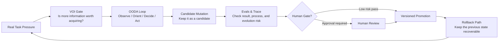

<p align="center">
  
</p>

# VOI-OODA AI System Evolver

**Languages:** [简体中文](./README.zh-CN.md) | [English](./README.en.md)

A controlled evolution skill library for upgrading AI systems, agent workflows, Codex skills, prompts, memory, RAG, tool routing, schemas, eval sets, and feedback loops.

It does not ask “how do we make the AI more intense?” It asks:

```text
Which information is worth acquiring?
Which changes deserve to remain?
What must pass a human gate?
How do we roll back if the change fails?
```

## Core Idea

AI system evolution should not depend on a lucky prompt patch, a one-off clever output, or an unreviewed rule change. This skill turns improvement into an auditable loop:



VOI decides whether more search, questions, memory reads, or experiments are worth the cost. OODA keeps the agent oriented in reality. Evals decide whether a candidate change deserves to remain. Human Gate prevents one useful mutation from contaminating future behavior. Rollback makes every promotion reversible.

## What It Helps With

| System Layer | Common Failure | Output |
| --- | --- | --- |
| Prompt | Rules accumulate and style drifts | Candidate prompt change, replay samples, rollback note |
| Memory | Unclear whether a fact belongs in long-term memory | Evidence, scope, counterexample check, expiry rule |
| RAG | Retrieval is noisy, stale, or hard to audit | Source quality check, citation rule, update gate |
| Tool Routing | Tools are called too early, too late, wrongly, or not at all | Routing change and minimal validation task |
| Workflow | The agent finishes work but cannot reproduce the path | Source contract, output gate, trace fields |
| Schema / Eval | Structures do not parse or evals miss edge cases | Schema checks, representative samples, regression set |
| Skill | The entrypoint is heavy, names drift, installability is unclear | Lightweight `SKILL.md`, self-contained references, templates, metadata |

## Repository Structure

```text
.
├── README.md
├── README.zh-CN.md
├── README.en.md
├── assets/
│   └── voi-ooda-system-evolver-hero.png
└── voi-ooda-ai-system-evolver/
    ├── SKILL.md
    ├── README.md
    ├── README.zh-CN.md
    ├── README.en.md
    ├── agents/
    │   └── openai.yaml
    ├── references/
    │   ├── evolution-loop-playbook.md
    │   ├── evolution-loop-playbook.zh-CN.md
    │   ├── evolution-loop-playbook.en.md
    │   ├── eval-versioning-playbook.md
    │   ├── eval-versioning-playbook.zh-CN.md
    │   └── eval-versioning-playbook.en.md
    └── templates/
        ├── evolution_proposal.md
        ├── evolution_proposal.zh-CN.md
        ├── evolution_proposal.en.md
        ├── ooda_voi_state.md
        ├── ooda_voi_state.zh-CN.md
        └── ooda_voi_state.en.md
```

## Quick Start

Install `voi-ooda-ai-system-evolver/` as a Codex skill. Then start with:

```text
Use $voi-ooda-ai-system-evolver to turn this AI workflow problem into a controlled evolution proposal with VOI, OODA, evals, Human Gate, and rollback.
```

If you only want to read the methodology, start here:

- `voi-ooda-ai-system-evolver/SKILL.md`: the lightweight agent entrypoint.
- `voi-ooda-ai-system-evolver/references/evolution-loop-playbook.en.md`: VOI/OODA evolution loop.
- `voi-ooda-ai-system-evolver/references/eval-versioning-playbook.en.md`: evals, traces, version promotion, and rollback.

## Standard Use

1. Define the system layer being upgraded: prompt, memory, RAG, tool routing, workflow, eval, schema, docs, or skill.
2. Pass a VOI gate before acquiring more information: would this information change a key decision or reduce high-impact risk?
3. Maintain a compact OODA state: Observe reality, Orient the map, Decide on a probe, Act, and Evaluate the result.
4. Keep system changes as `candidate`; do not promote them directly into long-term rules.
5. Use evals and trace evidence to decide whether the candidate deserves versioned promotion.
6. Apply Human Gate for high-risk actions.
7. Document rollback so the previous state can be restored.

## Output Contract

Every use should end by stating:

- what changed
- why the evidence is sufficient
- which evals or checks ran
- what remains `candidate`
- what needs Human Gate
- how to rollback

## Visual Asset

`assets/voi-ooda-system-evolver-hero.png` is the generated hero image for this README. It is used for atmosphere and recognition only. Critical process information is also represented in Markdown, tables, and Mermaid so the repository stays searchable and maintainable.

## Copyright

Copyright (c) 2026 @Paranoia. All rights reserved.
