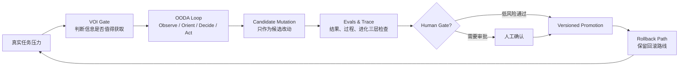

<p align="center">
  
</p>

# VOI-OODA AI System Evolver

一个用于升级 AI 系统、Agent workflow、Codex skill、prompt、memory、RAG、tool routing、schema 与 eval set 的受控进化技能库。

它回答的不是“怎么让 AI 更猛”，而是：

```text
哪些信息值得获取？
哪些改变值得留下？
什么必须经过人类门禁？
出问题时怎么回滚？
```

## 核心思想

AI 系统的进化不应该依赖一次灵感、一次 prompt 补丁，或者一次看起来更聪明的偶然输出。这个 skill 把改进拆成一条可审计的闭环：



VOI 决定是否值得继续搜索、追问、读取记忆或跑实验。OODA 让 agent 在真实任务中持续刷新地图。Evals 决定候选改动有没有资格留下。Human Gate 防止一次有用突变污染未来系统。Rollback 让每次升级都能退回。

## 适合处理什么

| 系统层 | 典型问题 | 产物 |
| --- | --- | --- |
| Prompt | 规则越补越乱，风格经常漂移 | 候选 prompt 改动、回放样本、回滚说明 |
| Memory | 该不该写入长期记忆不清楚 | 证据、适用范围、反例检查、过期机制 |
| RAG | 召回噪声高，来源过期或不可审计 | 来源质量检查、引用规则、更新门禁 |
| Tool Routing | 工具调用过早、过晚、缺失或误用 | 工具路由修正、最小验证任务 |
| Workflow | agent 经常做完但不可复现 | source contract、output gate、trace 字段 |
| Schema / Eval | 结构不可解析，评测覆盖不足 | schema 检查、代表样本、回归集 |
| Skill | skill 入口太重、命名不一致、难安装 | 轻量 `SKILL.md`、自洽 references、模板与 metadata |

## 仓库结构

```text
.
├── README.md
├── assets/
│   └── voi-ooda-system-evolver-hero.png
└── voi-ooda-ai-system-evolver/
    ├── SKILL.md
    ├── README.md
    ├── agents/
    │   └── openai.yaml
    ├── references/
    │   ├── evolution-loop-playbook.md
    │   └── eval-versioning-playbook.md
    └── templates/
        ├── evolution_proposal.md
        └── ooda_voi_state.md
```

## 快速开始

把 `voi-ooda-ai-system-evolver/` 作为一个 Codex skill 安装到你的 skills 目录。安装后可用这样的提示启动：

```text
使用 $voi-ooda-ai-system-evolver，把这个 AI workflow 问题整理成带 VOI、OODA、eval、Human Gate 和 rollback 的受控进化提案。
```

如果你只是想阅读方法论，可以从这三个入口开始：

- `voi-ooda-ai-system-evolver/SKILL.md`：agent 实际加载的轻量入口。
- `voi-ooda-ai-system-evolver/references/evolution-loop-playbook.md`：VOI/OODA 进化闭环。
- `voi-ooda-ai-system-evolver/references/eval-versioning-playbook.md`：eval、trace、版本提升与回滚。

## 一次标准使用长什么样

1. 先定义要升级的系统层：prompt、memory、RAG、tool routing、workflow、eval、schema、docs 或 skill。
2. 在额外获取信息前过 VOI：这条信息会不会改变关键决策，或降低高影响风险？
3. 维护短 OODA 状态：Observe 现实信号，Orient 刷新地图，Decide 选择探针，Act 产出，Evaluate 检查结果。
4. 把系统改动保持为 `candidate`，不要直接提升成长期规则。
5. 用 eval 和 trace 判断候选改动是否值得版本化。
6. 对高风险动作执行 Human Gate。
7. 写清 rollback，确保能退回上一版。

## 输出契约

每次使用这个 skill 结束时，至少说明：

- 改了什么。
- 证据为什么足够。
- 跑了哪些 eval 或检查。
- 什么仍然是 `candidate`。
- 什么需要 Human Gate。
- 如何回滚。

## 视觉资产说明

`assets/voi-ooda-system-evolver-hero.png` 是为本 README 生成的主视觉。它只承担概念氛围和识别作用，不承载关键文字信息；关键流程仍用 Markdown、表格和 Mermaid 表达，方便 GitHub 阅读、搜索和后续维护。

## 版权

Copyright (c) 2026 @Paranoia. All rights reserved.
