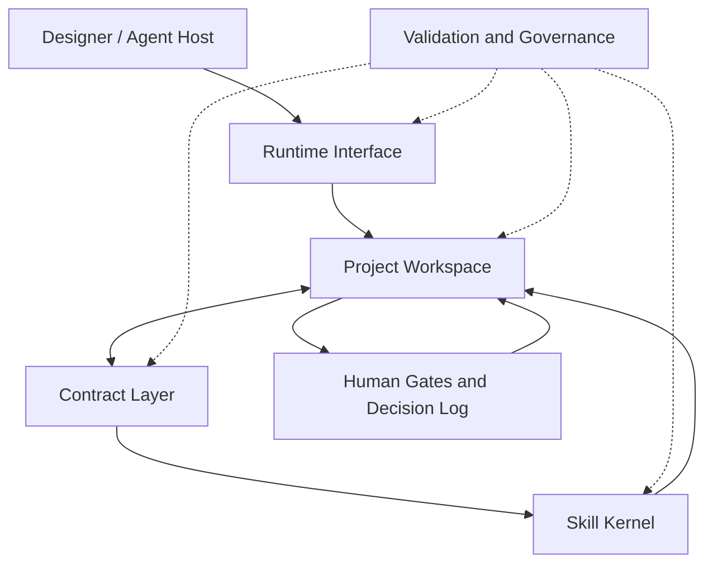
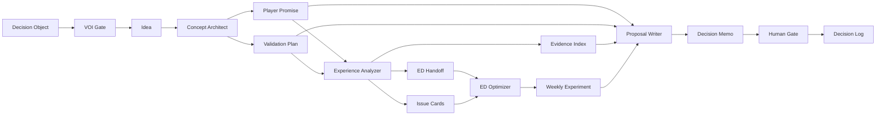

# GameDesignOS System Architecture

GameDesignOS v0.9.0 formalizes four product layers and one cross-cutting governance plane, with the first executable local runtime sitting at the interface layer.

> 中文摘要：四层分别是 Skill Kernel、Contract Layer、Project Workspace 与 Runtime Interface；Human Gate、验证、来源边界和回滚规则贯穿所有层。



## 1. Skill Kernel

The Skill Kernel contains the current specialist capabilities:

- `game-concept-architect`
- `game-experience-analyzer`
- `game-experience-density-optimizer`
- `game-design-proposal-writer`
- `paranoia-ai-system-evolver`
- `game-design-book-translator`
- `game-design-source-curator`

A skill owns a bounded expert workflow. It should not silently replace another skill's upstream or downstream responsibility.

## 2. Contract Layer

The Contract Layer defines stable artifact shapes and routing boundaries. Existing skill-level contracts include player promises, validation plans, evidence indexes, issue cards, and ED handoffs.

v0.8.0 introduced a cross-cutting decision-information contract and workspace-level contracts, and v0.9.0 makes them operable through local runtime commands:

- `information-value-assessment.schema.json`
- `project-workspace.schema.json`
- `design-asset-index.schema.json`
- `decision-log.schema.json`

Skill contracts define what a specialist produces. Workspace contracts define how those outputs remain organized, reviewable, and connected inside a project.

## Decision-Information Gate

Before a workflow expands research, retrieval, memory reads, analysis, or experimentation, it declares a Decision Object: owner, deadline, real options, current default action, stakes, reversibility, and boundary status.

```text
Decision Object
  -> action-sensitive uncertainty
  -> at most three information actions
  -> signal-to-action mapping
  -> EVPI ceiling / realistic EVSI / total cost
  -> smallest positive-net-VOI probe or act now
  -> stop rule
  -> posterior and action update
```

The gate is cross-cutting rather than a replacement for domain skills. It prevents information collection from becoming an unbounded project and preserves local negative evidence that can reverse the current narrative.

## 3. Project Workspace

The Project Workspace is the durable project context. It stores work by lifecycle rather than by chat session:

```text
00-inbox/          raw, unreviewed inputs
01-concept/        concept seeds, promises, loops, scope gates
02-evidence/       sources, screenshots, timestamps, evidence indexes
03-analysis/       diagnosis, issue cards, transfer boundaries
04-proposals/      decision memos, pitches, vertical-slice plans
05-experiments/    variants, instrumentation, dashboards, rollback rules
06-decisions/      human gates and decision logs
07-retrospectives/ learning and workflow writeback
```

The workspace manifest is `game.designos.yaml`. It identifies the project, GameDesignOS version, asset directories, visibility, and operating rules.

### Design Truth Order

When project materials disagree, use this order:

```text
accepted human decision
  > accepted reviewed asset
  > reviewed draft
  > unreviewed draft
  > inbox note
  > unstated agent assumption
```

Agents must surface conflicts instead of silently choosing whichever file is easiest to read.

## 4. Runtime Interface

The Runtime Interface connects a host agent or local CLI to the workspace, contracts, and skills.

In v0.9.0 it includes:

- a copyable workspace template;
- a defined workspace lifecycle;
- an executable `gamedesignos` CLI for `init`, `status`, `voi`, `route`, `new`, `validate`, `pack`, and `doctor`;
- workspace-aware adapter guidance;
- repository validation coverage.

v0.9.0 still does not ship a hosted API, model gateway, credential store, automatic skill execution, or project-commitment authority.

## 5. Governance Plane

Governance applies across every layer:

- source and privacy boundaries;
- evidence gates and unsupported-claim lists;
- smallest-suitable-skill routing;
- schema and repository validation;
- Human Gates before material commitments;
- evals before workflow promotion;
- rollback conditions before confidence.

## Default Production Flow



Knowledge-input skills can enrich references throughout the flow. The system-evolver skill operates at the meta layer when contracts, workflows, evals, or routing rules need controlled change.

## Asset Lifecycle

Recommended review states are:

```text
draft
  -> needs_review
  -> reviewed
  -> accepted | rejected
  -> superseded
```

`accepted` does not mean permanently true. It means the project has chosen to operate on that asset until new evidence or a new decision supersedes it.

## Extension Rule

A future module belongs in GameDesignOS only when it declares:

1. its trigger and non-trigger conditions;
2. its required upstream assets;
3. its stable outputs;
4. its evidence and privacy boundaries;
5. its human gate;
6. its eval and rollback path;
7. where its outputs live in a workspace.
