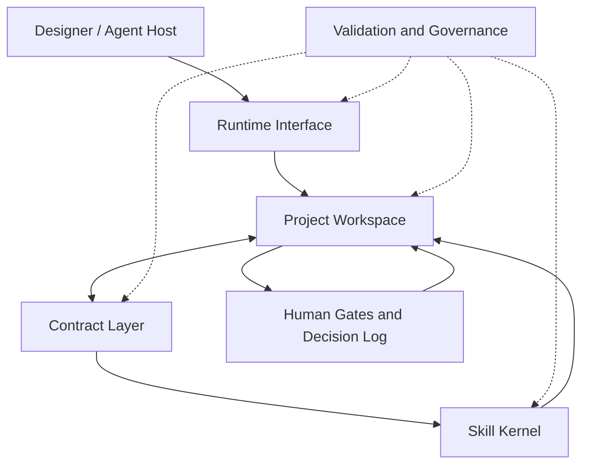
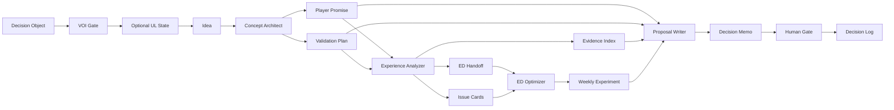

# GameDesignOS System Architecture

GameDesignOS uses four product layers and one cross-cutting governance plane. The tagged stable v1.2.0 runtime operates Project-Ready workspaces; the current v1.3 candidate adds portable runtime hardening plus optional UL (Uncertainty Ladder) state for attributable system evolution without migrating the v1 workspace schema.

> 中文摘要：四层分别是 Skill Kernel、Contract Layer、Project Workspace 与 Runtime Interface；Human Gate、验证、来源边界和回滚规则贯穿所有层。



## Public Repository Layout

The public repository separates editable truth, executable runtime, installable skills, proof, and generated output:

| Surface | Canonical paths | Responsibility |
| --- | --- | --- |
| Runtime package | `gamedesignos/` | Deterministic CLI, routing, workspace lifecycle, gates, graphs, validation, and packaging. |
| Specialist skills | the seven top-level `game-*` / `paranoia-*` skill directories | Independently installable expert workflows with their own references, templates, examples, metadata, and evals. |
| Editable contracts | `contracts/` | Canonical schemas and the only editable `router.yaml`. Built wheels receive generated snapshots; package snapshots are not a second editing surface. |
| Workspace templates | `runtime/workspace-template-v1/`, `runtime/workspace-template/` | Current Project-Ready v1 template and the compatible legacy v0.8/v0.9 template. |
| Product and workflow docs | `docs/product/`, `docs/workflows/` | Product boundary, architecture, roadmap, and end-to-end routes. |
| Public proof | `examples/`, skill `examples/`, `docs/showcases/` | Synthetic or cleared evidence that demonstrates bounded behavior without exposing private projects. |
| Validation and delivery | `scripts/`, `.github/`, `releases/`, `CHANGELOG.md` | Repository gates, behavior tests, package smoke checks, CI, version history, and release notes. |
| Integration and media | `adapters/`, `assets/` | Host-agent integration guidance and public visual material. |

`build/`, `dist/`, `*.egg-info/`, caches, reports, and private/local deliverables are generated or local-only and remain ignored. They are never release truth.

## 1. Skill Kernel

The Skill Kernel contains the current specialist capabilities:

- `game-concept-architect`
- `game-experience-analyzer`
- `game-experience-density-optimizer`
- `game-design-proposal-writer`
- `paranoia-ai-system-evolver`
- `game-design-book-translator`
- `game-design-source-curator`

A skill owns a bounded expert workflow. It should not silently replace another skill's upstream or downstream responsibility.

## 2. Contract Layer

The Contract Layer defines stable artifact shapes and routing boundaries. Existing skill-level contracts include player promises, validation plans, evidence indexes, issue cards, and ED handoffs.

v0.8.0 introduced a cross-cutting decision-information contract and workspace-level contracts, and v0.9.0 makes them operable through local runtime commands:

- `information-value-assessment.schema.json`
- `ul-state.schema.json`
- `project-workspace.schema.json`
- `design-asset-index.schema.json`
- `decision-log.schema.json`

Skill contracts define what a specialist produces. Workspace contracts define how those outputs remain organized, reviewable, and connected inside a project.

## Decision-Information Gate

Before a workflow expands research, retrieval, memory reads, analysis, or experimentation, it declares a Decision Object: owner, deadline, real options, current default action, stakes, reversibility, and boundary status.

```text
Decision Object
  -> action-sensitive uncertainty
  -> at most three information actions
  -> signal-to-action mapping
  -> EVPI ceiling / realistic EVSI / total cost
  -> smallest positive-net-VOI probe or act now
  -> stop rule
  -> posterior and action update
```

The gate is cross-cutting rather than a replacement for domain skills. It prevents information collection from becoming an unbounded project and preserves local negative evidence that can reverse the current narrative.

## UL Exposure-Control Layer

UL sits between VOI selection and OODA execution when a complex capability needs controlled progression:

```text
Decision Object
  -> VOI chooses the action-changing uncertainty
  -> UL-L0 ... UL-L5 controls exposure, scaffolds, attribution, and transfer
  -> OODA executes one bounded probe
  -> Eval decides replay, graduation, fallback, or stop
  -> RJR-AI / Human Gate limits authority and real-world consequence
```

The machine-readable artifact is `ul_state`, validated by `contracts/ul-state.schema.json`. A workflow may reference it through `workflow-run.governance.ul_state_ref`. The field is optional: ordinary domain work should not create UL state unless uncertainty exposure or failure attribution is itself the decision problem.

## 3. Project Workspace

The Project Workspace is the durable project context. The current schema `1.0.0` is decision-first and stores work by lifecycle rather than by chat session:

```text
00-inbox/          raw, unreviewed inputs
01-decisions/      Decision Objects, decision log, Human Gate outcomes
02-assumptions/    explicit assumptions, risk, confidence, validation state
03-evidence/       sources, observations, boundaries, unsupported claims
04-experiments/    plans, results, review state, rollback rules
05-design-assets/  concepts, analyses, proposals, and other governed assets
06-workflows/      workflow definitions and project-facing handoffs
07-learning/       reviewed learning and candidate workflow writeback
08-exports/        review-safe packs and explicitly cleared exports
.gamedesignos/     runtime state, workflow runs, and gate results
```

The workspace manifest is `game.designos.yaml`. It identifies the project, GameDesignOS version, asset directories, visibility, and operating rules.

The legacy schema `0.8.0` remains supported for compatibility and uses the earlier concept/evidence/analysis/proposal/experiment/decision/retrospective layout under `runtime/workspace-template/`. New projects default to the v1 layout; compatibility does not make the legacy template the current architecture.

### Design Truth Order

When project materials disagree, use this order:

```text
accepted human decision
  > accepted reviewed asset
  > reviewed draft
  > unreviewed draft
  > inbox note
  > unstated agent assumption
```

Agents must surface conflicts instead of silently choosing whichever file is easiest to read.

## 4. Runtime Interface

The Runtime Interface connects a host agent or local CLI to the workspace, contracts, and skills.

The current runtime includes:

- a copyable workspace template;
- a defined workspace lifecycle;
- an executable `gamedesignos` CLI for natural-language routing, Project-Ready lifecycle commands, gates, graphs, validation, packaging, and diagnostics;
- workspace-aware adapter guidance;
- repository validation coverage.

It still does not ship a hosted API, model gateway, credential store, automatic skill execution, or project-commitment authority. UL does not expand authority. Governance checkpoints default to `shadow`; humans retain residual judgment for high-coupling, low-reversibility, under-evidenced decisions.

## 5. Governance Plane

Governance applies across every layer:

- source and privacy boundaries;
- evidence gates and unsupported-claim lists;
- smallest-suitable-skill routing;
- schema and repository validation;
- Human Gates before material commitments;
- evals before workflow promotion;
- rollback conditions before confidence.

## Default Production Flow



Knowledge-input skills can enrich references throughout the flow. The system-evolver skill operates at the meta layer when contracts, workflows, evals, or routing rules need controlled change.

## Asset Lifecycle

Recommended review states are:

```text
draft
  -> needs_review
  -> reviewed
  -> accepted | rejected
  -> superseded
```

`accepted` does not mean permanently true. It means the project has chosen to operate on that asset until new evidence or a new decision supersedes it.

## Extension Rule

A future module belongs in GameDesignOS only when it declares:

1. its trigger and non-trigger conditions;
2. its required upstream assets;
3. its stable outputs;
4. its evidence and privacy boundaries;
5. its human gate;
6. its eval and rollback path;
7. where its outputs live in a workspace.
