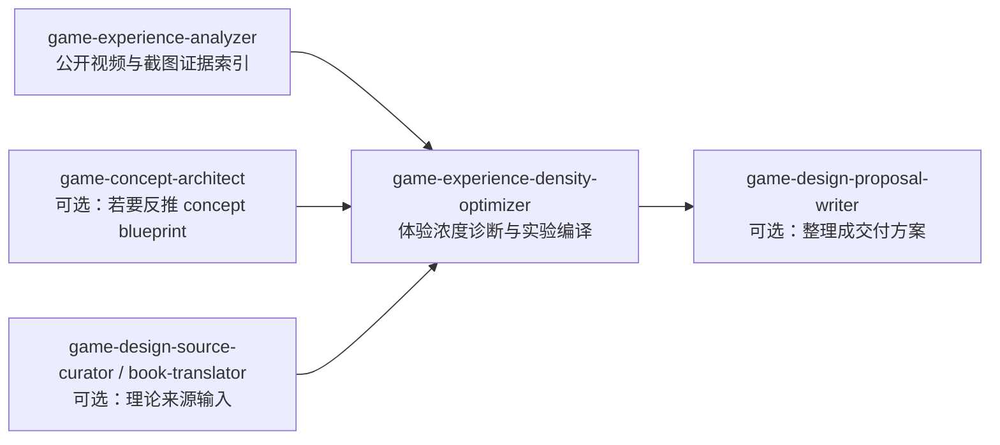
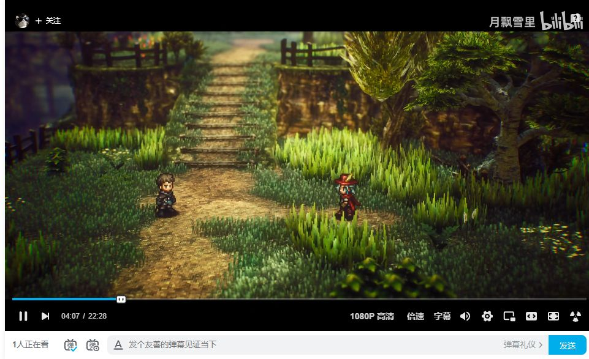
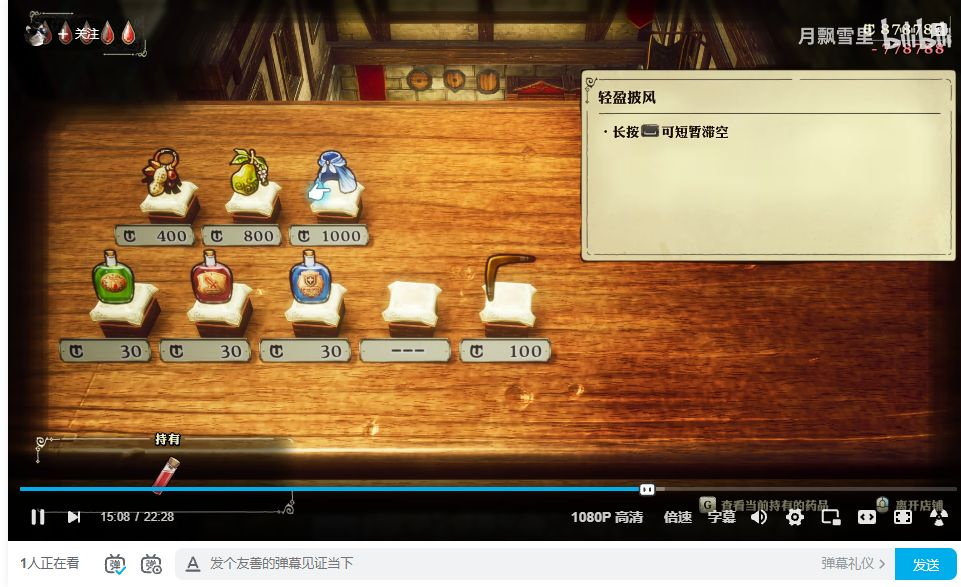
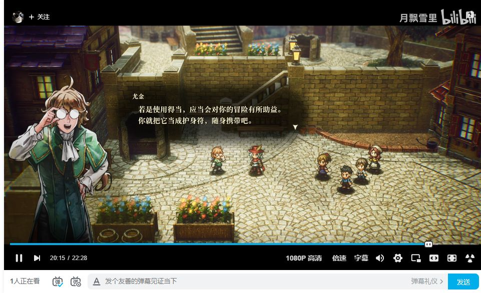
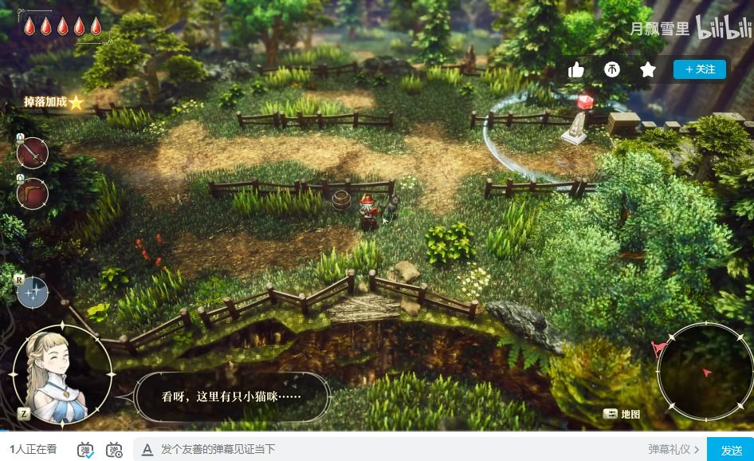
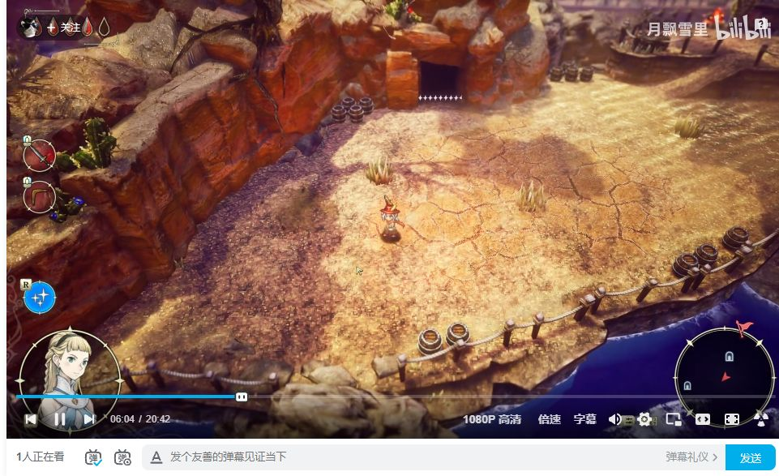
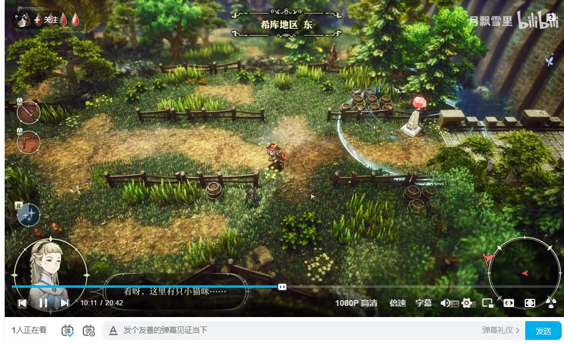
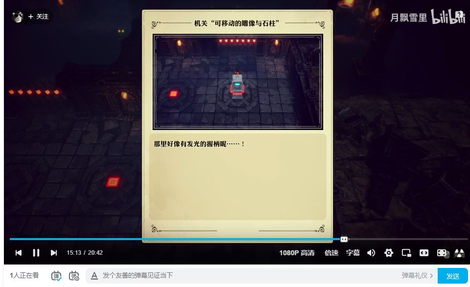
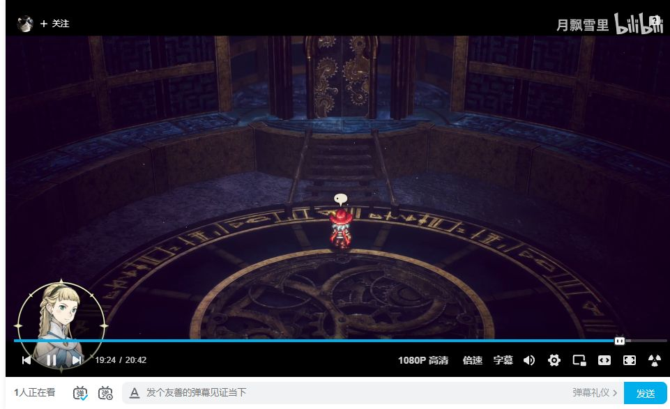

# 《冒险家艾略特的千年奇谭》Demo 体验浓度 GitHub 案例

> 本案例展示如何用 `game-experience-analyzer -> game-experience-density-optimizer` 把公开视频样本和已归档关键帧编译成一份可审计、可实验、可回滚的体验浓度方案。它面向 GitHub 仓库读者，重点是流程、证据边界和实验设计，不是商业预测。

| 字段 | 值 |
| --- | --- |
| game_name | 《冒险家艾略特的千年奇谭》Demo |
| source | Bilibili 公开视频 `BV12XLq6xEoM`，以及本目录已归档关键帧 |
| case_date | 2026-06-09 |
| pipeline | `game-experience-analyzer -> game-experience-density-optimizer` |
| output_mode | `full_client_delivery` |
| experiment_artifact_mode | `weekly_ab_plan` |
| theory_status | `design_hypothesis` |
| showcase_status | `github_case / repo_example / public_material_review_required` |

## 0. Case Summary

这份案例适合作为体验浓度 GitHub case，因为它具备清晰的公开样本、连续关键帧、早期 Demo 节奏问题和可实验的改造杠杆。案例重点不是“这个 Demo 好不好”，而是“它的体验浓度为什么成立、哪里不稳定、下一周该怎么验证”。

一句话结论：

> 当前 Demo 的主要问题不是“浓度低”，而是“竖向质感浓度很强，横向可决策浓度启动偏晚”。美术、场景层次、叙事身份感提供了高 `AR` 和较强 `SF`，但前 10-15 分钟玩家可主动改变节奏的机会偏少，部分教程和地图信息会抬高 `CLP`。优化顺序应是：先降噪，再补早期可归因反馈，最后谨慎提高有意义决策频率。

本案例不把它写成“好看所以值得做”的推荐，而把它落到三个可检验问题：

1. 前 10 分钟是否让玩家太久停留在被动接受状态？
2. 第一张野外图、第一处城镇和第一段遗迹是否形成了足够清晰的目标-行动-反馈闭环？
3. 降低说明噪声后，Demo 完成率、P2 到达率和继续探索意愿是否提升？

## 1. Case Boundary

| 字段 | 值 |
| --- | --- |
| case_visibility | `public_repo_example` |
| source_visibility_note | 公开视频样本，外部再发布前仍需人工确认授权、引用方式和截图使用边界 |
| data_sensitivity | `none` |
| output_destination | `repo_example` |
| game_metric_model | `premium_single_player` |
| target_user_segment | 单机 ARPG / HD-2D / JRPG 怀旧审美玩家，以及关注 Demo 完成体验的项目团队 |
| session_scope | Demo 早期流程样本，P1 “国王的任务”约 22:28，P2 “未知遗迹”约 20:42 |
| available_evidence | 12 张关键帧、旧报告中的时间轴观察、公开视频可见内容 |
| unavailable_evidence | 真实手柄输入、帧级操作手感、音频/震动反馈、完整 P3-P5、后台埋点、真实完成率和留存 |

可判断范围：

| 支持判断 | 不支持判断 |
| --- | --- |
| 早期 Demo 的视觉承诺、叙事进入成本、教程打断点、地图/商店/城镇/遗迹的可见信息密度 | 确定销量、D1/D7 留存、真实付费意愿、完整战斗深度、长期内容消耗 |
| P1/P2 片段内的体验浓度曲线、关键帧之间的节奏断点、玩家可能的认知负荷来源 | 音频、打击感、输入延迟、难度曲线、不同玩家群体的真实流失点 |
| 适合进入一周 A/B 或可玩性测试的设计假设 | “这一定会爆”“这一定不好玩”“上线后一定留存高” |

## 2. Evidence Gate

| 字段 | 值 |
| --- | --- |
| evidence_level | `L2_recording` |
| evidence_status | `directional_evidence` |
| confidence | 可见节奏与 UI/场景判断为 `medium`；手感、音频、真实指标判断为 `low` |
| allowed_claims | 公开视频样本中可观察到的画面事实、时间轴节奏、教程/UI 打断、早期互动窗口假设 |
| forbidden_claims | D1/D7、销量、完整口碑、输入手感、全部战斗系统、真实完成率、真实留存 |
| missing_evidence | 可玩 build、埋点、玩家分群、完成率、退出点、音频与震动、完整 Demo 后半段 |
| confounder_risks | `instrumentation_missing`, `player_segment_mix`, `version_mismatch`, `channel_mix` |

证据使用规则：

- 所有设计判断必须回到 `E01-E12` 中的截图或时间轴观察。
- ED 评分只用于同一 Demo 早期流程的相对诊断，不用于跨游戏排名。
- 所有实验方案必须写成可关闭配置或可回滚内容，不把一次审美判断包装成确定结论。
- 公开视频来源只作为观察样本；外部宣传或公众号发布需要单独人工确认素材使用边界。

## 3. 项目内 Skill 路由

本 showcase 的协作路线如下：



路由边界：

| skill | 本案例用途 | 不做什么 |
| --- | --- | --- |
| `game-experience-analyzer` | 提取关键帧、时间轴、视觉证据、样本边界 | 不直接给实验胜负结论 |
| `game-experience-density-optimizer` | 把证据编译成 ED 诊断、指标、变体、决策规则 | 不替代完整玩法设计，不输出无证据商业判断 |
| `game-design-proposal-writer` | 可选，把 ED 方案整理成对外交付稿 | 不改变证据等级，不新增未经验证的结论 |
| `game-concept-architect` | 可选，从案例反推可验证 concept seed | 不把竞品素材、角色、IP、美术直接迁移成方案 |
| `paranoia-ai-system-evolver` | 仅当要升级 skill 或路由规则时使用 | 不参与单个游戏设计判断 |

本案例不接 `game-design-master`。体验浓度 skill 的协作关系只看项目内现有 skill。

## 4. Metric Horizon Gate

| 字段 | 值 |
| --- | --- |
| game_metric_model | `premium_single_player` |
| primary_time_horizon | `total_journey` |
| current_measurement_window | Demo 早期 `chapter_segment` |
| p1_metric_family | `completion_progress` |
| secondary_metric_family | `total_playtime`, `replay_intent`, `wishlist_or_follow_intent`，如果平台允许 |
| excluded_metrics | `daily_retention`, `liveops_continuity`, `ARPDAU`, `D1/D7` |
| rationale | 买断制/单机 Demo 的核心目标不是每日回访，而是让玩家完成 Demo、理解核心承诺、愿意继续关注或购买 |

因此，本报告不用手游式 D1/D7 作为主指标。更合适的主指标是：

| 层级 | 指标 | 说明 |
| --- | --- | --- |
| P1 | `demo_completion_rate` | 完成当前 Demo 或目标章节的比例 |
| P1 | `p2_reach_rate` | 从 P1 进入 P2 或等价后续章节的比例 |
| P1 | `core_loop_reach_rate` | 玩家是否到达第一个完整目标-行动-反馈闭环 |
| P1 | `first_reward_feedback_time` | 从开始到第一次明确奖励/进展反馈的时长 |
| P1 | `meaningful_decision_count_0_10m` | 前 10 分钟有多少次可被玩家感知的有效选择 |
| P2 | `continue_intent_proxy` | Demo 结束后继续探索、加入愿望单、收藏、关注或回看后续信息 |
| negative | `early_exit_rate`, `tutorial_confusion_rate`, `map_stuck_rate` | 防止“加浓度”变成噪声或压力 |

## 5. Analyzer Evidence Handoff

| id | 片段 | 关键帧 | 可见事实 | 支持的 ED 判断 | 置信度 |
| --- | --- | --- | --- | --- | --- |
| E01 | P1 00:20 | `e01-p1-0020-opening-spectacle.png` | 开场仪式感强，场景层次、角色站位、光照都在建立世界承诺 | `AR` 高，开场审美吸引强 | high |
| E02 | P1 02:04 | `e02-p1-0204-royal-dialogue.png` | 王宫对话承接任务，文本密度和身份关系开始上升 | 目标明确，但早期被动叙事时间增加 | medium |
| E03 | P1 04:05 | `e03-p1-0405-first-field.png` | 首次野外画面打开，空间方向和探索承诺出现 | `SF` 开始形成，玩家获得移动空间 | high |
| E04 | P1 08:00 | `e04-p1-0800-tutorial-popup.png` | 教程弹窗进入，规则解释从场景流切到说明流 | `CLP` 上升，节奏有打断风险 | high |
| E05 | P1 15:05 | `e05-p1-1505-shop.png` | 商店 UI 暴露道具和经济入口 | 系统深度出现，但早期购物决策归因可能偏弱 | medium |
| E06 | P1 20:02 | `e06-p1-2002-town-dialogue.png` | 城镇对话和 NPC 关系继续展开 | 世界密度强，玩家主动目标仍需加强 | medium |
| E07 | P2 00:04 | `e07-p2-0004-navigation-circle.png` | 导航圈/目标指引出现 | 目标清晰度提升，可能降低迷路成本 | high |
| E08 | P2 06:01 | `e08-p2-0601-enemy-alert.png` | 敌人警戒或遭遇提示出现 | 威胁反馈增强，行动-反馈关系更明确 | medium |
| E09 | P2 07:10 | `e09-p2-0710-treasure-feedback.png` | 宝箱/奖励反馈出现 | `EB` 与 `SF` 得到补强，是可归因兴趣点 | high |
| E10 | P2 10:03 | `e10-p2-1003-world-map.png` | 世界地图或宏观导航出现 | 方向感增强，但信息层级可能抬高 `CLP` | medium |
| E11 | P2 15:02 | `e11-p2-1502-ruin-exploration.png` | 遗迹探索段落展开 | 空间探索和主题承诺增强，进入较优刺激窗口 | high |
| E12 | P2 19:12 | `e12-p2-1912-ruin-peak.png` | 遗迹高点/视觉峰值出现 | `AR` 峰值强，适合作为 Demo 记忆点 | high |

## 6. 关键截图解释卡

### E01 开场仪式感


| 维度 | 判断 |
| --- | --- |
| 可见事实 | 开场画面以宏观场景、队列、建筑层次和中心仪式感建立世界尺度。 |
| ED 含义 | `AR` 很高，玩家会先被“这是一个完整世界”的承诺吸住。 |
| 风险 | 如果可操作窗口太晚出现，强视觉会变成被动观看。 |
| 迭代动作 | 保留开场质感，但在 3-5 分钟内加入一次轻量可归因互动。 |

### E02 王宫任务对话


| 维度 | 判断 |
| --- | --- |
| 可见事实 | 任务与身份关系通过王宫对话交代，文本承载叙事和目标。 |
| ED 含义 | 目标感有支撑，但 `CLP` 开始积累。 |
| 风险 | 玩家记住“我要去哪里”，但未必立刻知道“我能做什么改变”。 |
| 迭代动作 | 压缩非必要礼仪文本，把第一个可操作目标提前或显性化。 |

### E03 首次野外



| 维度 | 判断 |
| --- | --- |
| 可见事实 | 画面从室内叙事切到野外，空间方向、道路和探索感出现。 |
| ED 含义 | `SF` 上升，这是从观看切到行动的关键窗口。 |
| 风险 | 如果野外第一段只承担移动过场，玩家的主动感仍然不足。 |
| 迭代动作 | 加一个微型岔路、可选采集、环境反馈或近景奖励，用低成本制造“我做了选择”。 |

### E04 教程弹窗


| 维度 | 判断 |
| --- | --- |
| 可见事实 | 教程信息以弹窗方式覆盖流程。 |
| ED 含义 | 规则可读性提升，但 `CLP` 和打断感上升。 |
| 风险 | 玩家刚进入行动状态时被拉回阅读状态，刺激曲线断开。 |
| 迭代动作 | 改成短提示 + 可展开说明，关键规则绑定到第一次使用后的即时反馈。 |

### E05 商店



| 维度 | 判断 |
| --- | --- |
| 可见事实 | 商店列表、价格、道具入口出现。 |
| ED 含义 | 系统深度出现，但早期经济决策是否有意义不确定。 |
| 风险 | 如果玩家不知道接下来会遇到什么，购物更像信息负担而不是策略选择。 |
| 迭代动作 | 首次商店只突出 1-2 个与下个目标直接相关的物品，弱化其它噪声。 |

### E06 城镇对话



| 维度 | 判断 |
| --- | --- |
| 可见事实 | 城镇 NPC 和对话延续世界观密度。 |
| ED 含义 | 叙事和世界连接变强，`AR` 稳定。 |
| 风险 | P1 后段如果仍主要靠对话推进，`MD/min` 偏低问题会持续。 |
| 迭代动作 | 把一个 NPC 对话改成可见后果的小选择，例如提示路线、给补给、改变旁白或开启隐藏互动。 |

### E07 导航圈



| 维度 | 判断 |
| --- | --- |
| 可见事实 | 目标指引或导航圈出现，玩家方向感变清楚。 |
| ED 含义 | 这是降低迷路噪声的好工具。 |
| 风险 | 如果只给方向，不给行动理由，玩家仍可能机械跟随。 |
| 迭代动作 | 导航提示同时显示“为什么去那里”和“到达后会获得什么反馈”。 |

### E08 敌人警戒



| 维度 | 判断 |
| --- | --- |
| 可见事实 | 遭遇、警戒或威胁提示出现。 |
| ED 含义 | 行动压力上升，反馈关系更清晰。 |
| 风险 | 目前只能看出视觉提示，不能确认打击感、AI、难度和输入响应。 |
| 迭代动作 | 埋点记录首次遭遇前后停顿、受伤、胜利、逃跑和退出情况。 |

### E09 宝箱反馈


| 维度 | 判断 |
| --- | --- |
| 可见事实 | 奖励、宝箱或获得反馈出现。 |
| ED 含义 | `EB` 和 `SF` 被补强，玩家能把探索行为归因到奖励。 |
| 风险 | 如果奖励只给数值，不改变下一步行动，惊喜会很快变薄。 |
| 迭代动作 | 首个宝箱奖励绑定一次立即可用的场景互动或战斗优势。 |

### E10 世界地图



| 维度 | 判断 |
| --- | --- |
| 可见事实 | 世界地图或宏观导航界面出现。 |
| ED 含义 | 总旅程承诺被打开，玩家知道世界不止当前场景。 |
| 风险 | 地图层级会提高信息量，对新玩家可能形成计划压力。 |
| 迭代动作 | 首次地图只高亮当前目标、已知安全点和一个可选兴趣点，不提前暴露过多入口。 |

### E11 遗迹探索



| 维度 | 判断 |
| --- | --- |
| 可见事实 | 遗迹段落进入更稳定的探索空间，主题、路径和氛围统一。 |
| ED 含义 | 这里接近较优刺激窗口，空间新奇度和行动目标比较协调。 |
| 风险 | 如果前面玩家已经被文本或 UI 消耗，可能到这里前已有流失。 |
| 迭代动作 | 把 P1 中的若干低互动段落压缩，让更多玩家带着精力进入遗迹。 |

### E12 遗迹峰值



| 维度 | 判断 |
| --- | --- |
| 可见事实 | 遗迹视觉高点形成记忆峰值。 |
| ED 含义 | `AR` 峰值强，适合作为 Demo 的传播和结尾记忆点。 |
| 风险 | 记忆峰值如果缺少玩家行为归因，会被记成“画面好看”而不是“我探索到了”。 |
| 迭代动作 | 峰值前加一个轻量选择或路径判断，让玩家把到达峰值归因为自己的行动。 |

## 7. ED Diagnosis

| 公式项 | 当前判断 | 证据 | 优先级 |
| --- | --- | --- | --- |
| `CLP` | 中等偏高，主要来自早期文本、教程弹窗、商店和地图信息 | E02, E04, E05, E10 | P0 |
| `SF` | 中高，场景层次、探索路径、奖励点能提供显著反馈 | E03, E07, E09, E11 | P1 |
| `EB` | 部分成立，但可归因奖励出现偏晚 | E09, E11 | P1 |
| `AR` | 高，开场和遗迹峰值都很强 | E01, E12 | 保留 |
| `MD/min` | P1 偏低，P2 中等；前 10 分钟可感知选择不足 | E02-E06, E07-E11 | P0 |

相对 ED scorecard：

| 项 | 分数 | 证据 | 风险 |
| --- | --- | --- | --- |
| `MD/min` | 2/5 in P1, 3/5 in P2 | P1 多为任务/教程/对话承接；P2 探索和奖励增多 | 没有真实操作日志 |
| `SF` | 4/5 | 野外、导航、宝箱、遗迹都在给明确刺激 | 不知道反馈声音、动画和手感 |
| `EB` | 2.5/5 | 宝箱和探索有惊喜，但早期惊喜较晚 | 奖励价值未知 |
| `AR` | 4.5/5 | 开场仪式感和遗迹峰值强 | 过强视觉可能遮住互动不足 |
| `CLP` | 3/5 | 弹窗、商店、地图、文本共同抬高理解成本 | 静态帧无法确认玩家实际阅读压力 |

| 字段 | 值 |
| --- | --- |
| normalized_ed_proxy_status | `relative_only` |
| confidence | `medium` for visible pacing, `low` for behavior metrics |
| primary_issue_item | `CLP` |
| primary_lever | `CLP` |
| next_lever | `MD/min` |
| diagnosis_order | 先降噪，再提质，后调频 |

## 8. Optimal Stimulation Fit

| 字段 | 判断 |
| --- | --- |
| band | `uneven` |
| boredom_type | `mixed`: P1 有 `low_agency`，教程/地图/商店处有 `over_stimulation` 风险 |
| player_resource_profile | 新玩家需要先建立目标、方向和行动信心；怀旧/JRPG 玩家对慢叙事容忍度更高 |
| stimulus_profile | 视觉刺激强，世界观和空间刺激强；早期可操作刺激和可归因奖励偏晚 |
| context_stimulation | `demo_opening` |
| primary_design_direction | `reduce_overload` |
| secondary_design_direction | `repair_agency`, `add_familiar_anchor`, `add_semi_novelty` |
| evidence_for_window | E03-E04 出现从行动到弹窗的断点；E09-E12 显示 P2 后段进入较佳探索/奖励窗口 |
| risk_if_misdiagnosed | 如果误判成“浓度不足”而继续加系统、加奖励、加文本，会把早期流程推向更高 `CLP` |

关键判断：

- 不是简单“加内容”。
- 不是把慢节奏全部砍掉。
- 真正需要的是让慢节奏带有轻微可操作纹理，让玩家在欣赏世界的同时感觉自己在推进世界。

## 9. Density Curve Intent

当前可见曲线：


建议目标曲线：

| 阶段 | 当前问题 | 目标状态 |
| --- | --- | --- |
| 0-3 min | 视觉承诺强，但玩家主要观看 | 保留仪式感，提前给一个轻触式互动 |
| 3-8 min | 野外行动刚出现，教程可能打断 | 把教程降为短提示，规则由第一次行为验证 |
| 8-16 min | 商店和系统入口可能早于需求 | 只暴露下个目标相关选择 |
| 16-25 min | 城镇关系建立，但主动性不足 | NPC 对话给轻微后果或路线分支 |
| P2 后段 | 探索和奖励开始进入好窗口 | 把这段提前一点，或降低前置消耗 |

## 10. Free Energy Window 与操作耦合

| 字段 | 判断 |
| --- | --- |
| free_energy_band | `too_high` at tutorial/map/shop moments, `optimal` in ruin exploration moments |
| prediction_error_source | 新规则、新地图、新经济入口、新目标同时进入时会让玩家预测成本上升 |
| tolerance_reason | 高质量视觉和明确世界承诺能提高玩家容忍度 |
| intervention_direction | `reduce_noise` first, then `improve_quality`, finally `tune_frequency` |
| sensory_state_quality | 画面层强，奖励可见，目标提示可见 |
| action_state_quality | 早期可操作选择偏少，P2 后段改善 |
| coupling_break | `weak_agency` 与 `overload` 风险并存 |
| repair_action | 弱化阻断式说明，把信息绑定到玩家刚做出的动作和马上能看到的反馈 |

## 11. Growth Surprise Ladder

| 字段 | 判断 |
| --- | --- |
| current_model_level | `explicit`: 玩家先理解任务、方向、教程和基础交互 |
| next_learnable_surprise | “我的一个小选择会改变路线、奖励或 NPC 反馈” |
| evidence_that_player_can_recover | E07-E09 显示导航和奖励反馈可帮助玩家恢复方向感 |
| risk_if_too_steep | 太早给商店、地图、复杂路线或多系统入口，会把惊喜变成压力 |

建议惊喜阶梯：

1. 第一次微选择：野外小岔路或可选采集，只改变 20-40 秒路径。
2. 第一次可归因奖励：宝箱或 NPC 回馈能立即改变下一场遭遇。
3. 第一次空间理解：地图只解释当前目标和一个可选兴趣点。
4. 第一次主题峰值：遗迹高点前让玩家做一次低风险路线判断。

## 12. Motivation & Flow Gate

| 字段 | 判断 |
| --- | --- |
| clear_goal_quality | 中高，主线目标存在，但行动理由可更短更明确 |
| feedback_timeliness | 中，P2 后段较好，P1 早期反馈偏晚 |
| challenge_skill_fit | `uneven`，战斗和操作缺少可验证证据 |
| player_control_quality | 中低到中，早期控制感不足，探索段改善 |
| autonomy_support | 中低，前 10 分钟需要更多轻量选择 |
| competence_support | 中，教程提供规则，但方式可能过重 |
| relatedness_support | 叙事关系强，但对 ED 不是主杠杆 |
| novelty_support | 强，但需要熟悉锚点来避免过载 |
| risk_if_optimized_only_for_density | 盲目加事件会破坏慢节奏和世界质感 |

## 13. 一周 ED 实验方案

### 13.1 Experiment Hypothesis

```text
如果我们在 Demo 前 15 分钟通过“降低说明噪声 + 提前一次轻量可归因互动”来调整体验浓度，
玩家会更快进入核心探索闭环，并在 demo_completion_rate、p2_reach_rate、core_loop_reach_rate、
first_reward_feedback_time 上改善，同时不提高 early_exit_rate、tutorial_confusion_rate 和 map_stuck_rate。
```

### 13.2 Variant Matrix

| variant_id | primary_lever | optimal_stimulation_target | concrete_change | config_keys | asset_changes | engineering_scope | impact_window | owner | qa_checks | confounder_risk | rollback |
| --- | --- | --- | --- | --- | --- | --- | --- | --- | --- | --- | --- |
| A_control | none | current | 当前版本，只补埋点 | `ed.variant=A` | none | telemetry only | full demo | data/QA | 分流、埋点、事件顺序可复现 | instrumentation_missing | none |
| B_reduce_clp | `CLP` | `reduce_overload` | 压缩 P1 王宫和教程文本；教程改短提示 + 可展开说明；首次地图只高亮当前目标 | `ed.opening_dialogue_max_lines`, `ed.tutorial_hint_mode`, `ed.map_first_focus` | 文本、教程 UI、地图默认高亮 | feature_flag + UI/text config | 0-12 min | design/UI/client | 不丢主线目标；教程仍可回看；地图不误导 | information_loss | config off |
| C_raise_vertical_quality | `SF/EB` | `improve_attributable_interest` | 首次野外加入一个可选小奖励；首个宝箱奖励能马上用于下一段遭遇 | `ed.first_field_micro_reward`, `ed.first_treasure_immediate_use` | 奖励配置、提示光效、可选采集点 | feature_flag + content config | 3-12 min | design/level/art | 奖励不破坏经济；不阻断主线 | reward_noise | config off |
| D_tune_md_frequency | `MD/min` | `add_semi_novelty` | 前 10 分钟加入两次低风险选择：小岔路、NPC 提示分支或补给选择 | `ed.micro_choice_count`, `ed.town_npc_choice`, `ed.route_branch_light` | 轻量路线、NPC 文本、反馈提示 | feature_flag + level/text config | 4-16 min | design/level/narrative | 不显著增加迷路率；选择后果可见 | overload | config off |

不建议本周做的变体：

| variant_id | 原因 |
| --- | --- |
| E_more_content | 现在的问题不是内容少，盲目加内容会提高 `CLP` |
| E_bigger_reward | 真实奖励价值未知，可能把归因从探索兴趣改成外部诱饵 |
| E_harder_combat | 没有手感和难度证据，风险过高 |

### 13.3 Instrumentation Dictionary

| event_name | trigger | required_fields | 用途 |
| --- | --- | --- | --- |
| `variant_assigned` | 玩家进入 Demo 或测试分流时 | `experiment_id`, `variant_id`, `client_version`, `user_segment`, `source_channel` | 确认样本归属 |
| `session_started` | Demo 会话开始 | `session_id`, `variant_id`, `timestamp`, `platform`, `input_device` | 建立会话基线 |
| `session_checkpoint` | 到达王宫结束、首次野外、教程、商店、城镇、P2、遗迹等节点 | `checkpoint_id`, `elapsed_seconds`, `variant_id` | 计算阶段到达率和耗时 |
| `meaningful_decision_made` | 玩家做出路线、补给、NPC、奖励或战斗相关选择 | `decision_id`, `decision_type`, `elapsed_seconds`, `available_options`, `chosen_option` | 统计 `MD/min` |
| `salient_feedback_fired` | 宝箱、奖励、目标推进、视觉峰值、NPC 回馈触发 | `feedback_id`, `feedback_type`, `source_action_id`, `elapsed_seconds` | 判断 `SF/EB` |
| `choice_impact_observed` | 玩家选择带来可见后果 | `decision_id`, `impact_type`, `delay_seconds`, `player_visible` | 判断可归因反馈 |
| `cognitive_load_signal` | 打开教程、地图、商店、长文本，或同一界面停留过久 | `source`, `dwell_seconds`, `close_method`, `reopen_count` | 监控 `CLP` |
| `optimal_stimulation_window_observed` | 玩家连续推进、低停顿、低回看且触发奖励/探索反馈 | `window_start`, `window_end`, `checkpoint_id`, `variant_id` | 判断是否进入较优刺激窗口 |
| `prediction_error_window_observed` | 新规则/新地图/新敌人进入后出现停顿、回退、重复打开说明 | `source`, `dwell_seconds`, `recovery_action` | 判断自由能窗口是否过高 |
| `blanket_coupling_signal` | 输入、反馈、目标提示之间出现断裂或顺畅闭合 | `coupling_type`, `latency_bucket`, `clarity_rating`, `checkpoint_id` | 判断感知-行动耦合 |
| `embodiment_signal_observed` | 战斗、移动、互动反馈可记录时 | `action_id`, `feedback_delay_ms`, `hit_confirmed`, `cancel_or_retry` | 后续补手感证据 |
| `journey_checkpoint_reached` | 到达 Demo 关键旅程节点 | `journey_step`, `elapsed_seconds`, `variant_id` | 对齐单机总旅程 |
| `session_ended` | 会话结束、退出或完成 | `end_reason`, `elapsed_seconds`, `last_checkpoint_id`, `variant_id` | 判断完成、退出和卡点 |

### 13.4 Metric Plan

| 层级 | 指标 | 目标 | 分群 |
| --- | --- | --- | --- |
| P1 | `demo_completion_rate` | B/C/D 任一变体相对 A 提升，且负向门不恶化 | all, new_to_jrpg, jrpg_familiar, action_familiar |
| P1 | `p2_reach_rate` | 进入 P2 或等价后续章节比例提升 | all |
| P1 | `core_loop_reach_rate` | 到达首次“目标-行动-反馈-奖励”闭环比例提升 | all |
| P1 | `first_reward_feedback_time` | 中位时间下降，且不牺牲目标理解 | all |
| P1 | `meaningful_decision_count_0_10m` | 只允许轻度提升，避免噪声式堆选择 | all |
| P2 | `optimal_stimulation_window_ratio` | P2 遗迹前后连续推进窗口增加 | all |
| P2 | `continue_intent_proxy` | Demo 结束后继续探索、收藏、关注、愿望单代理指标提升 | platform dependent |
| negative | `early_exit_rate` | 不升高 | all |
| negative | `tutorial_confusion_rate` | 不升高，B 变体尤其关注 | new_to_jrpg |
| negative | `map_stuck_rate` | 不升高，B/D 变体尤其关注 | all |
| negative | `dialogue_skip_spike` | 不出现异常上升 | all |

### 13.5 Dashboard Spec

默认过滤器：

| filter | values |
| --- | --- |
| `experiment_id` | `elliot_demo_ed_case_20260609` |
| `variant_id` | A/B/C/D |
| `client_version` | build id |
| `platform` | Steam / Switch / Playtest PC / unknown |
| `input_device` | keyboard_mouse / controller / unknown |
| `user_segment` | new_to_jrpg / jrpg_familiar / action_familiar / unknown |
| `checkpoint_id` | opening, royal_dialogue, first_field, tutorial, shop, town, p2_start, first_enemy, first_treasure, world_map, ruin_entry, ruin_peak |

核心图表：

| 图表 | 目的 |
| --- | --- |
| checkpoint funnel by variant | 看哪一段真正流失 |
| median elapsed time to first feedback | 看反馈是否被提前 |
| cognitive load dwell by source | 看教程、地图、商店是否降噪 |
| meaningful decisions per 10 minutes | 看 `MD/min` 是否轻度提高 |
| negative gate panel | 看优化是否引入迷路、困惑、早退 |
| optimal stimulation window timeline | 看 P2 遗迹窗口是否被更多玩家抵达 |

### 13.6 Decision Rules

| 决策 | 预注册条件 |
| --- | --- |
| amplify | P1 主指标至少 2 项优于 A，负向门无恶化，且玩家问卷没有“更碎/更吵”的明显反馈 |
| iterate | 主指标改善但某个负向门轻微恶化，保留方向，缩小改动范围 |
| observe | 样本不足、数据缺失或指标分歧，继续收样，不扩大改动 |
| rollback | `early_exit_rate`, `tutorial_confusion_rate`, `map_stuck_rate` 任一显著上升 |
| kill | 改动依赖误导、强迫、奖励噪声或无法解释的后验包装；或者证据不足却声称成功 |

### 13.7 Weekly Schedule

| 时间 | 目标 | 产物 |
| --- | --- | --- |
| 2026-06-09 | 冻结假设与证据边界 | 本报告、variant matrix、metric plan |
| 2026-06-10 | 接入配置和埋点 | feature flags、event schema、QA checklist |
| 2026-06-11 | 小样本可玩性检查 | crash/event missing/split balance 检查 |
| 2026-06-12 | 首轮数据复核 | checkpoint funnel、CLP dwell、first feedback time |
| 2026-06-13 至 2026-06-15 | 继续收样 | 分群样本、负向门监控、玩家短问卷 |
| 2026-06-16 | 决策复盘 | amplify / iterate / observe / rollback / kill |

## 14. 改进建议优先级

| 优先级 | 建议 | 关联证据 | 预期影响 | 验证方式 |
| --- | --- | --- | --- | --- |
| P0 | 王宫和教程文本降噪，教程从阻断弹窗改为短提示 + 可展开 | E02, E04 | 降低 `CLP`，减少前 10 分钟被动阅读 | `tutorial_confusion_rate`, `cognitive_load_signal` |
| P0 | 前 10 分钟增加 1-2 次轻量可归因选择 | E03, E06 | 提升 `MD/min` 和控制感 | `meaningful_decision_count_0_10m`, `choice_impact_observed` |
| P1 | 首个宝箱奖励绑定立即可用后果 | E09 | 提升 `EB` 和归因感 | `first_reward_feedback_time`, `salient_feedback_fired` |
| P1 | 首次地图只显示当前目标、已知安全点和一个兴趣点 | E10 | 降低地图过载，保留总旅程承诺 | `map_stuck_rate`, map dwell |
| P1 | 遗迹峰值前加一次低风险路线判断 | E11, E12 | 把“好看”转成“我探索到了” | `choice_impact_observed`, ruin completion |
| P2 | 对 P2 后段探索窗口做保留性增强 | E11, E12 | 保持高 `AR/SF`，不破坏慢节奏 | qualitative notes + checkpoint timing |

## 15. 禁止包装成结论的内容

这些内容在当前证据下不能说：

- 不能说这个 Demo 真实留存一定高。
- 不能说 D1/D7 会提升。
- 不能说战斗手感好或不好。
- 不能说完整商业化潜力已经被验证。
- 不能说玩家一定喜欢慢节奏。
- 不能说“只要加奖励就能解决问题”。
- 不能把截图中的静态美术表现等同于完整游戏体验质量。

可以说的是：

- 从公开视频样本和关键帧看，Demo 的视觉承诺与世界感很强。
- P1 早期主动决策密度偏低，是值得验证的主要风险。
- 教程、地图、商店和文本都有抬高 `CLP` 的可见风险。
- P2 后段遗迹探索更接近较优刺激窗口，值得让更多玩家更早、更省力地抵达。

## 16. 为什么这是体验浓度 GitHub 案例

普通案例容易把“我觉得好”写成结论。体验浓度 GitHub case 要把“为什么形成这个判断、哪里可能误判、下一步怎么证明”写清楚。

本报告的可复用价值在四点：

| 价值 | 说明 |
| --- | --- |
| 证据可回看 | 每个判断绑定 E01-E12，不靠空泛感受 |
| 边界可审计 | 明确只支持公开视频可见节奏，不支持商业和留存结论 |
| 实验可执行 | 变体、埋点、指标、决策规则、回滚条件都已预注册 |
| 路由可复用 | 演示了 `game-experience-analyzer -> game-experience-density-optimizer` 的项目内协作方式 |

## 17. Handoff Checklist

| 角色 | 交付物 |
| --- | --- |
| design | 假设、变体、成功标准、负向门、不可说结论 |
| narrative | 压缩文本、NPC 微后果、目标说明口径 |
| level | 首次野外微选择、遗迹峰值前路线判断 |
| UI/client | 教程提示模式、地图默认高亮、feature flag |
| data | event schema、dashboard、分群、数据质量门 |
| QA | 分流、埋点触发、回滚配置、关键路径可复现 |
| publishing | 若要对外发布，人工确认素材授权、截图边界和引用方式 |

## 18. 最终判断

这份 Demo 的强项应该被保留：慢节奏、世界感、视觉峰值、探索氛围都不是问题本身。真正需要处理的是“玩家在欣赏世界时，是否太晚获得可归因的行动感”。

因此最小改造不是大改系统，而是：

1. 压低前 10 分钟的信息噪声。
2. 提前一次轻量、有后果、低风险的玩家选择。
3. 让首个奖励或探索发现马上改变下一步行动。
4. 用 Demo 完成率、P2 到达率、首次反馈时间和负向门验证，而不是用主观热情替代证据。

如果这些变体成立，这个案例才适合从“公开视频观察样本”升级为“体验浓度流程标准样例”。
