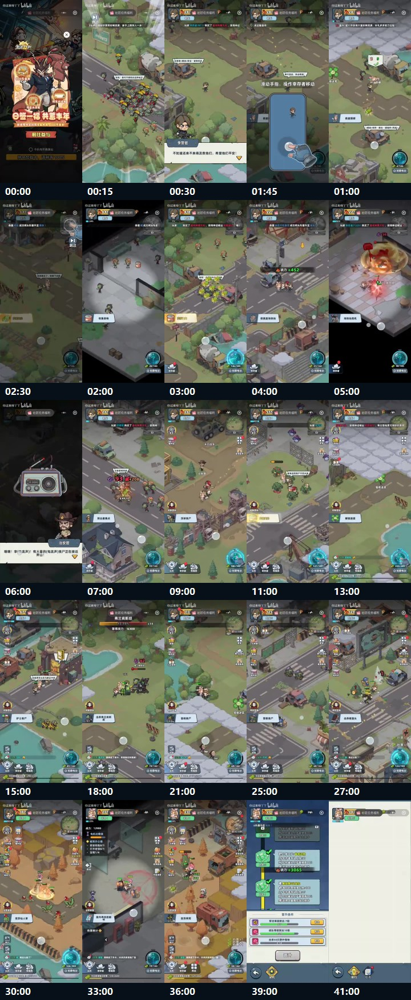

# 《生存33天》41 分钟试玩录屏诊断报告示例

> Source status note: this example is retained as a skill-behavior demo, but its public source status needs review before it is promoted as a public-material showcase.

本示例用于展示 `game-experience-analyzer` 升级后的诊断交付形态：先过样本边界门，再建立 Evidence Index，然后进入诊断包、问题卡和验证计划。它不是“看完视频后的观感总结”。

## 1. 样本边界门

| 字段 | 内容 |
| --- | --- |
| 样本边界 `sample_boundary` | B 站视频链接（source_status: needs_review），标题为“游戏试玩:丧尸rpg《生存33天》”，时长 41:30；本报告基于可访问页面元数据、页面互动数据和抽样关键帧，不含完整 ASR、后台埋点、正式版本数据。 |
| 可判断范围 `supported_judgment_scope` | 首局/首小时体验结构、前期 Hook、移动教学、任务牵引、自动/半自动战斗循环、功能暴露/首用、UI 信息密度、长线目标露出、可执行改版方向。 |
| 不可判断范围 `unsupported_judgment_scope` | 真实 D1/D7/D30 留存、付费率、广告收益、完整后期 Build 深度、服务器生态、买量转化、正式版本数值平衡、所有玩家群体口碑。 |
| 关键 unknown `key_unknowns` | 新号真实首小时漏斗、首战/首 Boss 到达率、功能入口点击热区、广告或礼包真实触发规则、是否存在未录到的手动技能深度、正式服是否已改版。 |
| 本次置信度上限 | 对“可见流程与 UI”可到高置信；对“长期留存和商业结果”最高只能到低置信假设。 |

## 2. 执行摘要

| 字段 | 结论 |
| --- | --- |
| 交付结论 | `Fix Before Scale`：短循环能跑通，但首屏 Hook、玩家决策和长期 Link 需要先修，再扩大投放或把它当作强样板。 |
| 主诊断包 | 首小时留存诊断包 |
| 辅助诊断包 | 核心循环诊断包、商业化打断诊断包、问题诊断 |
| 最大机会 | 丧尸题材、竖屏操作、自动战斗和战力成长在 3 分钟内被看懂，具备低门槛进入能力。 |
| 最大风险 | 玩家第一眼先看到“签到/代金券/福利”，不是“我为什么要在丧尸世界活 33 天”；后续又较快进入清单式任务和红点入口，生存幻想被系统噪音稀释。 |
| 30 天内必须验证 | A/B 测试“先福利弹窗”与“先危机场面 + 第 1/33 天目标”；同时验证首 10 分钟是否加入一个真实选择点能提升首战后继续率。 |

一句话判断：**《生存33天》的第一轮 Loop 是成立的，但它目前更像“丧尸皮的轻度数值任务 RPG”，还没有把“生存 33 天”变成玩家能复述、能担心、能主动选择的核心承诺。**

## 3. 样本元信息

| 字段 | 内容 |
| --- | --- |
| 游戏/项目 | 《生存33天》 |
| 视频标题 | 游戏试玩:丧尸rpg《生存33天》 |
| 链接 | https://www.bilibili.com/video/BV1uzfCBQEkh/ |
| BVID / AID / CID | BV1uzfCBQEkh / 116123701878279 / 36248158748 |
| 发布方 | 你过来呀丫丫 |
| 发布时间 | 2026-02-26 19:30:00 +08:00 |
| 本次访问/刷新时间 | 2026-05-29 |
| 视频时长 | 41:30 |
| 样本类型 | `video_url`；竖屏 story 试玩录屏；抽样关键帧分析 |
| 页面互动数据 | 播放 763，弹幕 0，评论 1，收藏 2，投币 2，分享 7，点赞 3 |
| 页面评论样本 | 1 条可见评论：“真棒” |
| 画面规格 | API 显示原视频 480 x 1066；本次抽帧使用可访问流中的关键帧 |
| 关键帧资产 | `examples/survival-33-days-assets/` |



## 4. 工具与访问状态

| 项目 | 状态 | 影响 | 处理 |
| --- | --- | --- | --- |
| 页面/元数据访问 | 可访问 Bilibili `x/web-interface/view` | 可确认标题、时长、发布者、发布时间、互动数据、封面、分辨率 | 作为样本事实层，不当作产品成败判断 |
| 播放流访问 | 可访问 `x/player/playurl` 返回的可播放流 | 可抽取关键帧；不是高清逐帧审片 | 用关键帧支撑前期体验诊断 |
| 字幕/ASR | 无字幕列表；未做完整 ASR | 旁白、音效、音乐情绪不作为强判断 | 只引用清晰可见画面、UI 文案、任务与战斗反馈 |
| OCR | 未跑完整 OCR | 小字号数值和滚动公告只作弱证据 | 只引用清晰可见文案 |
| 外部调研 | 未扩展 | 本次判断主要是样本内诊断 | VOI 不成立时不做泛搜 |

## 5. 诊断包路由

| 诊断包 | modes | 启用原因 | 不启用/降级原因 |
| --- | --- | --- | --- |
| 首小时留存诊断包 | `early_experience` | 41 分钟试玩覆盖首局理解、任务、战斗、成长和系统入口 | 不能推断 D7/D30 |
| 核心循环诊断包 | `gameplay_mechanics` | 样本展示移动、接敌、自动/半自动战斗、经验、战力、Boss、成长条件 | 后期 Build 深度未覆盖 |
| 商业化打断诊断包 | `commercialization` | 首屏即出现福利/代金券活动，影响第一眼 Hook | 未看到完整付费链路，不能判断收入效率 |
| 问题诊断 | `problem_diagnosis` | 用户需要把示例报告做成可交付诊断样板 | 不做泛泛“整体项目分析” |

不启用 `trailer_heat_prediction`：这是试玩录屏，不是 PV；低播放量只能作为传播背景，不能推出产品热度结论。

## 6. Evidence Index

| evidence_id | 定位 | event_type | observed_fact | supports_judgment | confidence |
| --- | --- | --- | --- | --- | --- |
| E001 | 00:00，首屏弹窗 | `monetization_prompt` | 进入第一眼是“日签一福共誓丰年”“888代金券”“前往参与”，主画面被福利活动覆盖。 | 福利/商业层抢在核心生存承诺前，削弱首屏 Hook。 | 0.92 |
| E002 | 00:15，野外道路 | `hook_peak` | 大量丧尸聚集，角色在尸群附近移动，丧尸题材威胁快速可见。 | 题材 Hook 本身成立，但出现晚于福利弹窗。 | 0.88 |
| E003 | 00:30，NPC 对话 | `feature_exposure` | 李警官说“来得及救他们，希望他们平安”，任务动机是救援。 | 叙事目标存在，但表达偏常规救援话术。 | 0.84 |
| E004 | 00:45，移动教学 | `control_release` | “滑动手指，操作幸存者移动”遮罩教学出现。 | 操作理解成本低，但强遮罩打断任务情绪。 | 0.90 |
| E005 | 01:00，主界面 | `feature_exposure` | 顶部任务、摇杆、右下按钮、电台/技能、底部入口同时可见。 | 核心操作可见，同时 UI 密度开始上升。 | 0.86 |
| E006 | 03:00，户外战斗 | `loop_closure` | 丧尸群、伤害数字、EXP、角色围攻同时出现。 | “移动 -> 接敌 -> 自动战斗 -> 经验反馈”第一轮 Loop 形成。 | 0.91 |
| E007 | 05:00，室内战斗 | `reward_claim` | 范围攻击、红色伤害、绿色治疗/战斗反馈增强。 | 战斗反馈足够热闹，但玩家决策仍不清楚。 | 0.78 |
| E008 | 06:00，对讲机叙事 | `feature_exposure` | 治安官通过电台推进事件。 | 游戏尝试把战斗循环接到人物关系和外部世界。 | 0.84 |
| E009 | 09:00，路径推进 | `feature_exposure` | 光点路径与“到达撤离点”等任务提示持续牵引。 | 主路径可读性强，迷路风险低。 | 0.87 |
| E010 | 11:00，采集/互动 | `first_use` | 任务从杀怪/移动切到采集类目标。 | 循环开始扩展，但操作差异仍有限。 | 0.75 |
| E011 | 18:00，Boss 战 | `hook_peak` | “弗兰肯斯坦”、首领战力 6300、长血条出现。 | 中前段有明确峰值和战力验证点。 | 0.90 |
| E012 | 27:00，主界面密集入口 | `confusion_signal` | 左侧活动/福利/七日/商店，右侧地图/入口，底部系统和红点同时可见。 | 中段 UI 入口竞争注意力，主目标容易被稀释。 | 0.86 |
| E013 | 39:00，头衔/晋升页 | `feature_unlock` | 多个晋升条件、战队等级、击杀目标、战力 +3065 可见。 | 长线成长清楚，但表现为条件清单而非生存压力。 | 0.89 |
| E014 | 41:00，菜单/排行/任务入口 | `feature_exposure` | 结尾更靠近系统菜单和排行/任务入口。 | 情绪收束弱，长线 Link 更偏工具入口。 | 0.72 |

## 7. 关键截图解读

关键截图不是装饰图，而是诊断证据。每张图都要说明：看到了什么、为什么重要、应如何迭代。

### E001 首屏福利弹窗：Hook 被福利层抢占


| 解释项 | 内容 |
| --- | --- |
| 可观察事实 | 进入第一眼是全屏福利活动：“日签一福共誓丰年”“888代金券”“前往参与”，底部还有“拼命加载中...100%”。 |
| 设计含义 | 它把玩家的第一眼认知从“丧尸生存危机”转成“福利领取/活动入口”。这不是不能做福利，而是不该在核心承诺建立前全屏抢占。 |
| 诊断判断 | 首屏 Hook 顺序错误。福利并非无效，但它应该服务留存承接，而不是替代题材钩子。 |
| 迭代动作 | 首次进入先给 3-5 秒危机场面或“第 1/33 天”目标，福利弹窗延后到首次战斗胜利后，或缩成非阻塞底部浮层。 |

### E002 00:15 尸群画面：真正的题材 Hook 已经有，但来晚了


| 解释项 | 内容 |
| --- | --- |
| 可观察事实 | 角色站在道路和尸群附近，画面立刻能读出丧尸题材、威胁环境和移动探索空间。 |
| 设计含义 | 这张图才是更适合作为第一眼的 Hook：有敌群、有道路、有行动方向，也符合“生存33天”的承诺。 |
| 诊断判断 | 素材本身不缺题材钩子，问题是首屏排序和展示优先级。 |
| 迭代动作 | 把这类画面前置到福利前，叠加“第 1 天 / 还有 32 天”或“救援是否来得及”的轻量目标。 |

### E004 移动教学：低成本上手成立，但遮罩打断情绪


| 解释项 | 内容 |
| --- | --- |
| 可观察事实 | 强遮罩提示“滑动手指，操作幸存者移动”，摇杆区域被放大，玩家能立即知道怎么动。 |
| 设计含义 | 教学可读性很好，适合轻度用户；但遮罩把刚建立的救援/尸群情绪暂停了。 |
| 诊断判断 | 上手不是问题，问题是教学没有借势包装成“逃离尸群/赶去救人”的动作。 |
| 迭代动作 | 把教学文案改成任务化表达，例如“拖动幸存者，绕开尸群去救李警官”，让教学同时承担叙事和操作。 |

### E006 03:00 第一轮战斗 Loop：短循环清楚成立


| 解释项 | 内容 |
| --- | --- |
| 可观察事实 | 角色群殴丧尸，出现伤害数字、EXP、任务指引和右下技能/电台按钮。 |
| 设计含义 | 玩家很容易理解“移动接敌 -> 战斗 -> 获得经验 -> 继续任务”的基础循环。 |
| 诊断判断 | Loop 不是弱项，真正的弱项是循环中的主动选择太少。 |
| 迭代动作 | 在首战后给一个轻量取舍：救 NPC、拿补给、绕开尸潮、硬闯。让 Loop 从“跟着走”变成“我做了选择”。 |

### E008 06:00 电台叙事：Link 的种子出现了


| 解释项 | 内容 |
| --- | --- |
| 可观察事实 | 画面进入对讲机/电台界面，治安官通过通讯推进事件。 |
| 设计含义 | 这是把局内打怪接到外部世界的好入口：玩家不只是刷怪，而是在和幸存秩序发生联系。 |
| 诊断判断 | Link 有种子，但还没有变成可持续压力。玩家知道有人在说话，却未必知道社区状态如何被自己改变。 |
| 迭代动作 | 电台每次推进都反馈一个社区状态变量：幸存者、物资、危险等级、救援进度。 |

### E011 18:00 Boss 战：峰值明确，但机制记忆不足


| 解释项 | 内容 |
| --- | --- |
| 可观察事实 | “弗兰肯斯坦”首领、战力 6300、长血条和持续战斗反馈同时出现。 |
| 设计含义 | 这是前中段最适合制造 Surprise 的节点，能承担第一个强记忆点。 |
| 诊断判断 | 当前更像数值门槛和血条峰值，还不是规则变化峰值。 |
| 迭代动作 | 给 Boss 一个可读机制：召唤尸潮、封路红圈、保护 NPC、打断蓄力。让玩家记住“怎么打赢”，而不是只记得“战力够不够”。 |

### E012 27:00 UI 密度：系统入口开始压过主目标


| 解释项 | 内容 |
| --- | --- |
| 可观察事实 | 左侧活动/福利/七日/商店入口，右侧地图和功能格，底部头衔/幸存者/营地，以及多个红点同时存在。 |
| 设计含义 | 系统供给很丰富，但玩家注意力会从“当前要救谁/去哪里/怎么活”转向“哪里有红点”。 |
| 诊断判断 | 入口密度不是绝对错误；问题是它出现时，生存 Link 还没有足够稳。 |
| 迭代动作 | 入口分阶段开放。0-10 分钟只保留任务、角色成长、背包/补给；活动和商城在首 Boss 后再显性展开。 |

### E013 39:00 头衔晋升：长线目标清楚，但幻想表达弱


| 解释项 | 内容 |
| --- | --- |
| 可观察事实 | 头衔/晋升页列出战队等级、战斗等级、击杀目标等条件，并给出战力 +3065。 |
| 设计含义 | 数值成长非常明确，玩家知道继续做什么；但这张图更像条件清单，不像“营地能否撑过 33 天”。 |
| 诊断判断 | 长线目标可读，但情绪承诺没有跟题材绑定。 |
| 迭代动作 | 把晋升条件转译成营地状态：幸存者数量、物资库存、危险等级、距离救援剩余天数。 |

## 8. 阶段化时间轴

| 阶段 | 时间范围 | 玩家表面目标 | 实际设计目标 | evidence_refs | 诊断 |
| --- | --- | --- | --- | --- | --- |
| Entry | 00:00-00:20 | 关闭/跳过福利弹窗，进入试玩 | 先暴露福利和登录激励 | E001, E002 | 真实题材 Hook 在 00:15 才出现，首屏记忆被福利弹窗劫走。 |
| First Understanding | 00:20-01:30 | 跟 NPC 和箭头移动 | 教玩家移动、看任务、进入战斗场景 | E003, E004, E005 | 操作理解很顺，但“为什么我要活 33 天”尚未被建立。 |
| First Loop | 01:30-07:00 | 打怪、跟光点、获得经验 | 建立任务、战斗、奖励、下一目标闭环 | E006, E007, E008 | Loop 低门槛成立，问题在玩家主动选择较少。 |
| Early Growth | 07:00-18:00 | 连续清怪、采集、到达目标点、打 Boss | 用任务类型、Boss 和战力变化维持推进 | E009, E010, E011 | 节奏稳定，但玩法变化主要是目标名和数值强度变化。 |
| System Expansion | 18:00-33:00 | 解锁更多任务、区域、敌人和入口 | 展示中期内容供给和系统密度 | E012 | 内容供给可见，UI 噪音和红点竞争开始成为体验负担。 |
| Long-Term Link | 33:00-41:30 | 查看头衔、排行、任务和条件 | 把首局接到长期成长 | E013, E014 | 长线目标清楚但清单化，缺少“社区是否能撑过 33 天”的情绪压力。 |

## 9. Hook / Loop / Link / Surprise 评分

| 维度 | 分数 | evidence_refs | 成立点 | 问题信号 | 修改方向 |
| --- | --- | --- | --- | --- | --- |
| Hook | 3/5 | E001, E002, E003 | 丧尸威胁很快可见，救援动机能被理解。 | 第一眼是福利/代金券，不是生存危机；救援动机偏通用。 | 首次进入先给 3-5 秒“第 1/33 天危机”或尸潮救援失败，再延后福利弹窗。 |
| Loop | 4/5 | E004, E006, E007, E009 | 移动、接敌、战斗、经验、任务推进非常快被看懂。 | 战斗更像跟随任务和数值反馈，主动选择不足。 | 早期加入一次低成本选择：救人/拿补给/绕路/硬闯。 |
| Link | 2.5/5 | E008, E012, E013, E014 | 电台、治安官、头衔和条件页能把局内接到长期目标。 | 长期目标偏表格和入口，不像一个“幸存社区正在变化”的世界。 | 把头衔条件翻译成基地状态、幸存者数量、危险等级和 33 天倒计时。 |
| Surprise | 3/5 | E007, E011, E013 | Boss、范围特效、战力 +3065 提供阶段峰值。 | Surprise 多来自数值和新入口，不来自规则反转或玩家决策后果。 | 第一个 Boss 增加机制峰值：召唤尸潮、封路、保护 NPC 或打断施法。 |

## 10. 核心循环诊断

| 模块 | evidence_refs | 当前机制 | 玩家决策 | 风险 | 诊断 |
| --- | --- | --- | --- | --- | --- |
| 核心动作 | E004, E006 | 摇杆移动，接近敌人后进入自动/半自动战斗。 | 主要是走向目标和接敌。 | 决策空间过轻，容易从“我在生存”变成“我在跟光点走”。 | 必须在首 5 分钟安排至少 1 个真实取舍。 |
| 战斗反馈 | E006, E007, E011 | 伤害数字、治疗、EXP、长血条、战力门槛。 | 技能时机和站位目的不够清楚。 | 看起来热闹，但不一定形成掌控感。 | 技能需要明确承担清怪、打断、保护或位移中的一个功能。 |
| 任务牵引 | E003, E009, E010 | NPC 对话、光点路径、撤离点、采集点。 | 多数任务是顺着路径完成。 | 目标明确但线性，重复后疲劳。 | 主线光点保留，支线奖励用风险选择打开。 |
| 成长/长线 | E013, E014 | 头衔、战队等级、击杀目标、排行/任务入口。 | 达成条件、领取奖励、进入系统。 | 条件很清楚，但幻想较弱。 | 条件页应绑定社区生存状态，而不是只做战力清单。 |
| UI/商业/福利 | E001, E005, E012 | 福利、活动、七日、商店、任务、地图、底部入口并存。 | 玩家可点很多入口。 | 入口早于核心承诺稳定，注意力被分散。 | 0-10 分钟隐藏非必要入口，红点只服务当前目标。 |

## 11. 功能账本

| Feature | Exposure | Unlock | First Use | evidence_refs | Confidence |
| --- | --- | --- | --- | --- | --- |
| 签到/福利活动 | 00:00 | 进入即暴露 | 00:00 可点“前往参与” | E001 | 高 |
| 主线任务追踪 | 00:15-00:30 | 初始可见 | 00:30 起通过 NPC/气泡推进 | E002, E003, E009 | 高 |
| 摇杆移动 | 00:45 | 教学弹窗暴露 | 00:45 后立即使用 | E004 | 高 |
| 自动/半自动战斗 | 03:00 前后 | 接敌后自然出现 | 03:00 丧尸群战斗 | E006 | 高 |
| 技能/战斗按钮 | 01:00 前后 | 初始 UI 暴露 | 05:00 前后战斗中可见 | E005, E007 | 中 |
| 电台/治安官叙事 | 06:00 | 第一次强叙事暴露 | 06:00 通过对话推进 | E008 | 高 |
| 采集/交互任务 | 11:00 前后 | 任务链暴露 | 11:00 采集点 | E010 | 中高 |
| Boss / 首领战 | 18:00 | 中前段暴露 | 18:00 与弗兰肯斯坦战斗 | E011 | 高 |
| 头衔/晋升 | 39:00 | 中后段进入条件页 | 39:00 查看晋升条件 | E013 | 高 |
| 排行/任务菜单 | 41:00 | 结尾菜单可见 | 未充分展示使用 | E014 | 中 |

## 12. 关键问题卡

```yaml
issue_id: I001
priority: P0
diagnosis_pack: "first_hour_retention_diagnosis"
symptom: "首屏第一眼被签到/代金券福利活动占据，核心生存危机延后出现。"
evidence_refs: [E001, E002]
root_cause_hypothesis: "商业/福利层级早于题材承诺，导致玩家最先记住福利入口，而不是丧尸生存目标。"
impact: "影响前 10 秒记忆点、首战进入动机和素材截图传播。"
fix_action: "首次进入先播 3-5 秒危机场面或第 1/33 天目标，再在首战后弹福利。"
owner: "product_ux"
validation:
  metric: "前 30 秒留存、首战进入率、福利弹窗关闭率"
  method: "ab_test"
  pass_threshold: "危机先行版本前 30 秒留存 +5%，首战进入率 +8%，福利点击不下降超过 3%"
  stop_condition: "留存无提升且福利点击下降超过 5%"
unsupported_by_sample: false
```

```yaml
issue_id: I002
priority: P0
diagnosis_pack: "core_loop_diagnosis"
symptom: "第一轮循环被看懂，但玩家选择主要是跟随路径和接敌，战斗决策偏轻。"
evidence_refs: [E004, E006, E007, E009]
root_cause_hypothesis: "自动/半自动战斗反馈足够，但首 5 分钟缺少明确取舍，导致掌控感弱于数值反馈。"
impact: "影响核心玩法留存和玩家对游戏差异点的复述。"
fix_action: "在首战后加入一次低成本取舍：救 NPC / 拿补给 / 绕开尸潮 / 硬闯；不同选择影响 1 个短期资源或队友状态。"
owner: "combat_system_design"
validation:
  metric: "选择完成率、首 5 分钟操作次数、第二任务进入率"
  method: "playtest"
  pass_threshold: ">=70% 玩家能复述选择差异，第二任务进入率 +6%"
  stop_condition: "选择导致卡顿或教程失败率上升超过 5%"
unsupported_by_sample: false
```

```yaml
issue_id: I003
priority: P1
diagnosis_pack: "monetization_interruption_diagnosis"
symptom: "中段入口、红点和活动层级较密，任务目标与系统入口竞争注意力。"
evidence_refs: [E005, E012]
root_cause_hypothesis: "系统入口开放节奏快于玩家长期目标建立。"
impact: "增加认知负担，削弱主线沉浸和首次任务链完成率。"
fix_action: "0-10 分钟只保留任务、角色成长、背包/补给三个核心入口；其他活动入口延后或折叠。"
owner: "ux_ui"
validation:
  metric: "误点率、任务链完成率、入口点击分布"
  method: "telemetry_review"
  pass_threshold: "误点率下降 >=20%，首 10 分钟任务链完成率 +5%"
  stop_condition: "核心入口发现率下降超过 5%"
unsupported_by_sample: false
```

```yaml
issue_id: I004
priority: P1
diagnosis_pack: "first_hour_retention_diagnosis"
symptom: "长期目标清楚但清单化，'生存33天'没有变成可见压力。"
evidence_refs: [E008, E013, E014]
root_cause_hypothesis: "头衔/晋升条件提供数值目标，但没有把救援、营地和幸存者状态可视化。"
impact: "影响 D1/D7 回访理由和玩家对题材承诺的复述。"
fix_action: "把晋升条件转译成营地状态：幸存者数量、物资库存、危险等级、第几天倒计时。"
owner: "narrative_system_design"
validation:
  metric: "目标复述率、次日回访意向、长线入口点击率"
  method: "playtest"
  pass_threshold: ">=60% 测试玩家能复述'为什么要继续活到第 33 天'"
  stop_condition: "玩家只记住数值提升，无法复述世界目标"
unsupported_by_sample: false
```

```yaml
issue_id: I005
priority: P2
diagnosis_pack: "core_loop_diagnosis"
symptom: "Boss 提供战力峰值，但机制记忆点不够强。"
evidence_refs: [E011]
root_cause_hypothesis: "Boss 主要作为血量/战力门槛出现，而不是规则变化点。"
impact: "降低第一个可传播战斗片段和玩家首次挑战记忆。"
fix_action: "让弗兰肯斯坦拥有一个独特规则：召唤尸潮、封路、保护 NPC、或需要打断蓄力。"
owner: "combat_level_design"
validation:
  metric: "Boss 到达率、Boss 胜率、战斗后记忆点提及率"
  method: "playtest"
  pass_threshold: "记忆点提及率 >=50%，胜率维持在 65%-85%"
  stop_condition: "失败率过高或玩家无法理解机制"
unsupported_by_sample: false
```

## 13. 方案路线

| 动作 | 对象 | evidence_refs | 预期收益 | 成本 | 风险 | owner |
| --- | --- | --- | --- | --- | --- | --- |
| `change` | 首屏顺序 | E001, E002 | 把玩家第一眼从福利切回丧尸生存承诺 | 低 | 福利点击可能下降 | product_ux |
| `change` | 首 5 分钟决策点 | E004, E006, E009 | 提升核心循环掌控感和玩法复述率 | 中 | 教程复杂度上升 | combat_system_design |
| `cut` | 早期非必要红点 | E005, E012 | 降低任务干扰和误点 | 低 | 活动曝光降低 | ux_ui |
| `change` | 长线 Link 表达 | E008, E013, E014 | 把条件清单转成“生存 33 天”的可见压力 | 中 | 需要 UI/叙事重包 | narrative_system_design |
| `validate` | 首 Boss 机制峰值 | E011 | 增强可传播记忆点 | 中 | 战斗难度波动 | combat_level_design |

## 14. 验证计划

```yaml
validation_id: V001
target_judgment: "首屏福利弹窗削弱生存题材 Hook。"
evidence_refs: [E001, E002]
unknown_to_resolve: "危机场面前置是否能提升新用户首 30 秒继续率，同时不显著损失福利点击。"
minimum_sample: "新用户 A/B，各版本至少 1000 次进入。"
method: "ab_test"
metric:
  primary: "前 30 秒留存"
  secondary: ["首战进入率", "福利点击率", "弹窗关闭率"]
pass_threshold: "前 30 秒留存 +5%，首战进入率 +8%，福利点击下降 <=3%。"
kill_condition: "留存无提升且福利点击下降 >5%。"
decision_after_result:
  pass: "正式采用危机先行开场。"
  fail: "保留福利但缩小为底部浮层，不全屏覆盖。"
```

```yaml
validation_id: V002
target_judgment: "首 5 分钟缺少真实选择，核心循环掌控感不足。"
evidence_refs: [E004, E006, E007, E009]
unknown_to_resolve: "增加一个低成本取舍是否提升玩家对玩法差异的理解。"
minimum_sample: "8-12 人可用性测试 + 线上小流量埋点。"
method: "playtest"
metric:
  primary: "选择完成率"
  secondary: ["第二任务进入率", "技能使用率", "玩法差异复述率"]
pass_threshold: ">=70% 玩家能复述选择后果，第二任务进入率 +6%。"
kill_condition: "教程失败率或退出率上升 >5%。"
decision_after_result:
  pass: "把选择点固化为首局核心教学。"
  fail: "降级为可选支路，不阻塞主线。"
```

```yaml
validation_id: V003
target_judgment: "早期 UI 入口密度影响主线推进。"
evidence_refs: [E005, E012]
unknown_to_resolve: "折叠活动/商店/七日入口是否提升任务链完成率。"
minimum_sample: "线上埋点对比 7 天。"
method: "telemetry_review"
metric:
  primary: "首 10 分钟任务链完成率"
  secondary: ["误点率", "入口点击分布", "活动入口最终点击率"]
pass_threshold: "任务链完成率 +5%，误点率下降 >=20%。"
kill_condition: "活动入口最终点击下降 >10% 且留存无提升。"
decision_after_result:
  pass: "采用分阶段入口开放。"
  fail: "保留入口但降低红点优先级。"
```

```yaml
validation_id: V004
target_judgment: "长线 Link 清楚但缺少生存压力和情绪承诺。"
evidence_refs: [E008, E013, E014]
unknown_to_resolve: "营地状态/33 天倒计时是否比头衔条件更能驱动回访。"
minimum_sample: "20 人首小时试玩访谈 + D1 回访意向问卷。"
method: "playtest"
metric:
  primary: "目标复述率"
  secondary: ["D1 回访意向", "长线入口点击率"]
pass_threshold: ">=60% 玩家能复述'继续玩是为了让社区撑过 33 天'。"
kill_condition: "玩家仍只复述战力和任务清单。"
decision_after_result:
  pass: "将头衔页重包为营地生存状态。"
  fail: "保留头衔页，另做主线剧情目标强化。"
```

## 15. 置信度声明

- 高置信：首屏福利先于题材 Hook、首轮移动/战斗/经验 Loop 成立、UI 入口密度在中段上升、长线条件页清单化。
- 中置信：战斗决策偏轻、Boss 机制记忆点不足、Link 对 D1 回访的影响。
- 低置信 / unsupported：真实 D7 留存、付费率、广告收益、买量转化、正式版本后期 Build 深度。
- 仍需补料：真实新号首小时连续录像、埋点漏斗、热区点击、A/B 版本数据、玩家访谈。

## 16. 结构化摘要

```json
{
  "analysis_mode": "early_experience + gameplay_mechanics + commercialization + problem_diagnosis",
  "diagnosis_packs": [
    "first_hour_retention_diagnosis",
    "core_loop_diagnosis",
    "monetization_interruption_diagnosis"
  ],
  "executive_decision": "Fix Before Scale",
  "source": {
    "type": "video_url",
    "url": "https://www.bilibili.com/video/BV1uzfCBQEkh/",
    "title": "游戏试玩:丧尸rpg《生存33天》",
    "duration": "41:30",
    "accessed_at": "2026-05-29",
    "access_notes": "Bilibili metadata and playable stream were accessible; analysis used sampled keyframes, not full ASR."
  },
  "sample_scope_gate": {
    "supported_judgment_scope": [
      "首局体验结构",
      "核心循环可读性",
      "功能暴露节奏",
      "UI 信息密度",
      "可执行改版方向"
    ],
    "unsupported_judgment_scope": [
      "D7/D30 留存",
      "真实付费率",
      "买量转化",
      "正式版本后期平衡"
    ],
    "key_unknowns": [
      "真实首小时漏斗",
      "功能入口点击热区",
      "A/B 验证数据"
    ]
  },
  "four_step_scores": {
    "hook": 3,
    "loop": 4,
    "link": 2.5,
    "surprise": 3
  },
  "top_issues": [
    {
      "issue_id": "I001",
      "title": "福利弹窗抢首屏 Hook",
      "evidence_refs": ["E001", "E002"]
    },
    {
      "issue_id": "I002",
      "title": "第一轮循环成立但决策偏轻",
      "evidence_refs": ["E004", "E006", "E007", "E009"]
    },
    {
      "issue_id": "I004",
      "title": "长期目标清单化，生存压力不足",
      "evidence_refs": ["E008", "E013", "E014"]
    }
  ],
  "minimum_validation": [
    "V001: A/B test crisis-first opening versus immediate welfare popup",
    "V002: test first-five-minute decision point",
    "V003: telemetry review for staged UI entry exposure",
    "V004: playtest camp-state / 33-day countdown link"
  ]
}
```
